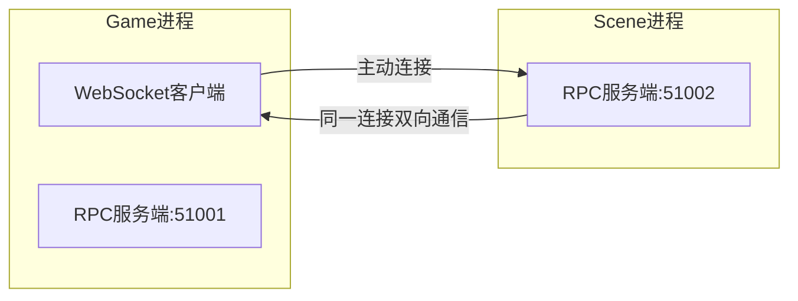
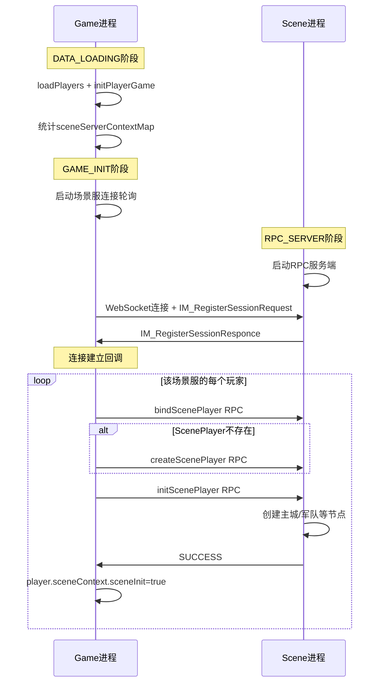

# Game-Scene 双进程协作初始化与异常处理方案

## 一、现状分析

### 1.1 当前代码存在的问题

- **`initPlayerScene()` 从未被调用** — [PlayerService.java](slg-game/src/main/java/com/slg/game/base/player/service/PlayerService.java) 中定义了方法但无调用点
- **`startServerConnection()` 从未被调用** — [InnerSessionManager.java (game)](slg-game/src/main/java/com/slg/game/net/manager/InnerSessionManager.java) L99-115，仅定义了方法
- **`removeSession()` 断线处理为空** — Game 侧 `InnerSessionManager.removeSession()` L57-65 有 TODO 注释但未实现
- **Scene 侧 RPC 断线未清理会话** — [RpcServerMessageHandler.java](slg-net/src/main/java/com/slg/net/rpc/handler/RpcServerMessageHandler.java) `onDisconnect()` 仅记录日志，未调用 `InnerSessionManager.removeSession()`（Scene 仅通过 RPC 服务端接收 Game 连接，无独立 WebSocketServer，`SceneServerMessageHandler` 应删除）
- **Scene 不感知玩家初始化状态** — `ScenePlayerManager` 无法判断某个玩家是否已完成完整的场景初始化
- **`connectServer()` 使用 `synchronized`** — 违反虚拟线程规范，需改为 `ReentrantLock`
- **`connectServer()` 始终返回 `true`** — 无论连接是否实际成功都返回 true，调用方无法区分成功与失败
- **断线时未主动清理 RPC 回调** — 连接断开后，pending 的 RPC Future 只能等 30 秒超时，未主动 fail
- **`SceneContext.sceneInit` 缺少 `volatile`** — 该字段被 Player 链写入、Login 链读取（跨线程访问），但未声明 `volatile`，存在可见性隐患

### 1.2 连接拓扑



Game 作为 WebSocket 客户端主动连接 Scene 的 RPC 服务端。连接建立后通过 `IM_RegisterSessionRequest` / `IM_RegisterSessionResponce` 完成双向会话注册，后续 RPC 调用在同一连接上双向进行。

### 1.3 启动时序（LifecyclePhase）

```
TABLE_CHECK(MAX-7000) → DATABASE(MAX-6000) → DATA_LOADING(MAX-5000) → GAME_INIT(MAX-4000)
→ SCENE_INIT(MAX-3000) → TICK_INIT(MAX-2000) → RPC_SERVER(MAX-1000) → WEBSOCKET_SERVER(MAX)
```

---

## 二、整体架构设计

### 2.1 启动初始化时序



### 2.2 断线处理策略

**设计原则**：短暂网络抖动不应导致大规模清理和重建。双方都设置缓冲窗口，只有确认对方真正失联后才执行破坏性操作。

```mermaid
flowchart TD
    subgraph sceneLost [Scene失联 - Game侧检测]
        A1[GameClientMessageHandler.onDisconnect] --> A2[快速重连3次 无间隔 ~3秒]
        A2 -->|成功| A3[Scene响应needReInit]
        A3 -->|needReInit=true| A3a[批量initPlayerScene]
        A3 -->|needReInit=false| A3b[ConnectState→READY]
        A2 -->|失败| A2b["deadline阶段 每1秒重试 共~10秒"]
        A2b -->|某次成功| A3
        A2b -->|deadline到期| A4[Player链标记sceneInit=false]
        A4 --> A5[Login链踢所有受影响玩家下线]
        A5 --> A6[延迟10秒后启动慢重连]
        A6 -->|重连成功| A7[Scene响应needReInit=true]
        A7 --> A7a[批量initPlayerScene]
    end
    
    subgraph gameLost [Game失联 - Scene侧检测]
        B1[RpcServerMessageHandler.onDisconnect] --> B2[启动10秒宽限期定时器]
        B2 -->|10秒内Game重连| B3[取消定时器]
        B3 --> B3a[注册响应needReInit=false]
        B2 -->|10秒后仍未重连| B4[正式清理]
        B4 --> B5[despawn所有关联节点]
        B5 --> B6[移除Watcher + 重置初始化状态]
    end
```



---

## 三、Game 侧改动

### 3.1 SceneServerContext 增强

文件：[SceneServerContext.java](slg-game/src/main/java/com/slg/game/base/player/model/SceneServerContext.java)

新增连接状态管理。`ConnectState` 是**纯服务器连接状态**，仅描述与 Scene 服的连接可用性，不代表玩家场景已初始化——玩家初始化的唯一依据是 `Player.sceneContext.sceneInit`：

```java
public enum ConnectState {
    DISCONNECTED,       // 未连接（初始状态 / 断线后）
    CONNECTING,         // 连接中（正在尝试重连 / 已连接等待注册确认）
    READY               // 连接就绪，可用于 RPC 通信
}

// 使用 AtomicReference 保证状态转换的原子性（CAS 防止并发误判）
private final AtomicReference<ConnectState> connectState = new AtomicReference<>(ConnectState.DISCONNECTED);
```

状态流转：
- `DISCONNECTED → CONNECTING`：两个触发点——(1) `connectServer` 成功建立 WebSocket 连接并发送注册请求后设置（首次连接和断线重连均适用），(2) 断线后 `removeSession` 中 CAS 成功，启动重连
- `CONNECTING → READY`：`socketRegisterResponse` 收到成功响应
- `READY → DISCONNECTED`：连接断开，`removeSession` 中先 set DISCONNECTED
- `CONNECTING → DISCONNECTED`：连接断开（如 connectServer 成功但注册响应未到连接又断），`removeSession` 中先 set DISCONNECTED

### 3.2 连接建立回调触发初始化

文件：[InnerSocketFacade.java (game)](slg-game/src/main/java/com/slg/game/net/facade/InnerSocketFacade.java)

在 `socketRegisterResponse` 收到成功响应后，先将 `ConnectState` 设为 READY（纯连接状态），再根据 `needReInit` 决定是否触发批量初始化：

```java
@MessageHandler
public void socketRegisterResponse(NetSession netSession, IM_RegisterSessionResponce response) {
    if (response.getResult() == 0) {
        int sceneServerId = netSession.getServerId();
        // 1. 注册成功 → 连接就绪（ConnectState 是纯服务器状态，无论是否需要重新初始化都设为 READY）
        SceneServerContext ctx = playerManager.getSceneServerContextMap().get(sceneServerId);
        if (ctx != null) {
            ctx.getConnectState().set(ConnectState.READY);
        }
        // 2. 根据 needReInit 决定是否批量初始化
        if (response.isNeedReInit()) {
            // 首次连接或宽限期已过（Scene 已清理），需要批量初始化
            Executor.System.execute(() -> {
                playerService.batchInitPlayerScene(sceneServerId);
            });
        }
        // needReInit=false：Scene 节点仍在，玩家各自的 sceneInit 状态保持为 true，无需额外操作
    }
}
```

### 3.3 PlayerService 增加批量初始化

文件：[PlayerService.java](slg-game/src/main/java/com/slg/game/base/player/service/PlayerService.java)

新增 `batchInitPlayerScene(int sceneServerId)` 方法：
- 从 `SceneServerContext` 获取该场景服的所有 playerIds
- 逐个在玩家线程中调用 `initPlayerScene(playerId)`（已有方法，通过 `Executor.Player.execute` 分发）
- 注意：`ConnectState` 已在 `socketRegisterResponse` 中设为 READY，此处无需再设置；个别玩家初始化失败由登录时补偿兜底

### 3.4 InnerSessionManager 断线处理实现

文件：[InnerSessionManager.java (game)](slg-game/src/main/java/com/slg/game/net/manager/InnerSessionManager.java)

完善 `removeSession()` 方法。Game 侧采用快速重连（3 次，无间隔，立即重试）+ deadline 机制。快速重连失败后进入 deadline 阶段（每 1 秒异步重试），deadline 总时间 10 秒（与 Scene 宽限期对齐）。deadline 到期仍未成功才确认 Scene 失联，踢掉受影响玩家并启动慢重连（10 秒间隔，延迟后首次尝试）。

**`removeSession` 统一在 System 链中执行**（由 `GameClientMessageHandler.onDisconnect` 分发到 System 链），与 `quickReconnect` 的递归调度在同一条链上，保证状态转换的串行性。

**断线时先设 DISCONNECTED 再 CAS**：断线了状态就该是 DISCONNECTED。先 `set(DISCONNECTED)` 再 `CAS(DISCONNECTED→CONNECTING)` 确保无论从哪个状态断线（包括 CONNECTING——如 connectServer 成功但注册响应未收到时连接又断），都能正确启动重连，不会卡在 CONNECTING 状态。由于 `removeSession` 在 System 单链中执行，`set` + `CAS` 之间不会有其他 `removeSession` 插入，两步操作实质上是原子的。CAS 更多是防御性编程：

```java
/**
 * 断线处理（在 System 链中调用）
 */
public void removeSession(NetSession session) {
    int sceneServerId = session.getServerId();
    serverId2Session.remove(sceneServerId);
    
    SceneServerContext ctx = playerManager.getSceneServerContextMap().get(sceneServerId);
    if (ctx == null) return;
    
    // 断线时主动 fail 该连接上所有 pending RPC 回调（避免调用方等 30 秒超时）
    rpcCallBackManager.failAllByServerId(sceneServerId, new RpcDisconnectException("Scene server " + sceneServerId + " disconnected"));
    
    // 先设 DISCONNECTED：断线了状态就是断线，确保从任何状态（包括 CONNECTING）都能正确恢复
    ctx.getConnectState().set(ConnectState.DISCONNECTED);
    
    // CAS 防御：DISCONNECTED→CONNECTING（在 System 单链中此 CAS 必定成功，作为防御性编程保留）
    if (!ctx.getConnectState().compareAndSet(ConnectState.DISCONNECTED, ConnectState.CONNECTING)) {
        return;
    }
    
    // 启动快速重连（3次，无间隔，立即重试）
    quickReconnect(sceneServerId, ctx);
}

/**
 * 快速重连 + deadline 机制
 * 先同步尝试 3 次（无间隔，最多阻塞 ~3 秒），失败后进入 deadline 阶段（异步调度，每 1 秒重试一次）。
 * deadline 从断线时刻开始计算，总时间 DISCONNECT_DEADLINE_MS（10 秒），与 Scene 宽限期对齐。
 * deadline 到期仍未成功才确认失联、踢人。
 */
private void quickReconnect(int sceneServerId, SceneServerContext ctx) {
    long deadlineEnd = System.currentTimeMillis() + DISCONNECT_DEADLINE_MS;
    for (int attempt = 0; attempt < QUICK_RECONNECT_ATTEMPTS; attempt++) {
        if (connectServer(sceneServerId)) {
            return;
        }
    }
    // 快速重连全部失败，进入 deadline 阶段（每 1 秒异步重试一次，不阻塞 System 链）
    deadlineReconnect(sceneServerId, ctx, deadlineEnd);
}

/**
 * deadline 阶段重连：每 1 秒通过 schedule 异步尝试一次，不阻塞 System 链
 * deadline 到期仍未成功则确认失联，执行 handleSceneServerLost
 */
private void deadlineReconnect(int sceneServerId, SceneServerContext ctx, long deadlineEnd) {
    Executor.System.schedule(() -> {
        if (shuttingDown) {
            return;
        }
        if (System.currentTimeMillis() >= deadlineEnd) {
            handleSceneServerLost(sceneServerId, ctx);
            return;
        }
        if (!connectServer(sceneServerId)) {
            deadlineReconnect(sceneServerId, ctx, deadlineEnd);
        }
    }, 1, TimeUnit.SECONDS);
}
```

`handleSceneServerLost(int sceneServerId, SceneServerContext ctx)`:
- 遍历 `ctx.getPlayerIds()`，**在 Player 链中先设标记再条件踢人**（保证因果顺序）：
  ```java
  for (long playerId : ctx.getPlayerIds()) {
      Executor.Player.execute(playerId, () -> {
          Player player = playerManager.getPlayer(playerId);
          if (player == null) return;
          // 先设标记：保证玩家重登时一定能看到 sceneInit=false
          player.getSceneContext().setSceneInit(false);
          // 再条件踢人：只踢在线玩家
          if (player.getSession() != null && player.getSession().isActive()) {
              Executor.Login.execute(() -> loginService.logout(player.getSession()));
          }
      });
  }
  ```
- **关于 logout 分发到 Login 链**：`loginService.logout()` 是轻量操作（标记下线、清理 session 映射、无重 IO），即使 1000 个玩家批量踢下线，Login 链总耗时也在百毫秒级别。此外，登录/登出操作**必须在同一条串行链中有序执行**，否则可能产生 login/logout 交错导致的状态不一致（如 A 玩家正在登录绑定 session，B 玩家的 logout 并发清理了相同资源）。因此保持 Login 单链分发是正确的设计选择。
- 启动 `startConnection(ctx, 10000)` 持续探测
- 后续重连成功时，Scene 宽限期已过（10 秒 deadline 到期后又延迟 10 秒才首次尝试慢重连），Scene 必定已清理，响应 `needReInit = true`，Game 执行完整重新初始化

### 3.5 connectServer 修复

文件：[InnerSessionManager.java (game)](slg-game/src/main/java/com/slg/game/net/manager/InnerSessionManager.java)

四项修复：
1. **`synchronized` → `ReentrantLock`**：符合虚拟线程规范，避免 pin 载体线程
2. **返回值修复**：当前代码无论连接是否成功都返回 `true`，需根据实际结果返回
3. **WebSocket 连接超时设为 1 秒**：`quickReconnect` 在 System 单链中同步执行 `connectServer`，连接超时直接决定 System 链的最大阻塞时间。设为 1 秒后，3 次快速重连最多阻塞 System 链约 3 秒，既能覆盖瞬时抖动的恢复窗口，又不会长时间阻塞系统任务。连接超时通过 `WebSocketClientManager.connect(url, connectTimeoutMs)` 参数传入（如 `WebSocketClientManager` 不支持此参数，需扩展）
4. **连接成功后设置 `ConnectState = CONNECTING`**：WebSocket 连接建立并发送注册请求后，显式将 `ConnectState` 设为 `CONNECTING`。这确保无论是首次启动还是断线重连，3.8 节的注册响应超时检测都能正常工作。断线重连时 `removeSession` 已提前设了 `CONNECTING`，`connectServer` 再设一次是幂等操作，无副作用：

```java
/** WebSocket 连接超时（毫秒）：快速重连在 System 单链中同步执行，超时越短阻塞越少 */
private static final int CONNECT_TIMEOUT_MS = 1000;

public boolean connectServer(int serverId) {
    if (serverId == gameserverConfiguration.getServerId()) {
        return true; // 本服直接返回
    }
    NetSession netSession = serverId2Session.get(serverId);
    if (netSession != null && netSession.isActive()) {
        return true; // 已有活跃连接
    }
    lock.lock();
    try {
        netSession = serverId2Session.get(serverId);
        if (netSession != null && netSession.isActive()) {
            return true;
        }
        String url = "url从zk中获取";
        // 连接超时 1 秒：快速重连 3 次最多阻塞 System 链约 3 秒
        netSession = WebSocketClientManager.getInstance().connect(url, CONNECT_TIMEOUT_MS);
        if (netSession != null && netSession.isActive()) {
            netSession.setServerId(serverId);
            serverId2Session.put(serverId, netSession);
            // 设置 CONNECTING：确保首次启动和断线重连场景下注册超时检测（3.8）都能生效
            // 断线重连时 removeSession 已设了 CONNECTING，此处再设是幂等操作
            SceneServerContext ctx = playerManager.getSceneServerContextMap().get(serverId);
            if (ctx != null) {
                ctx.getConnectState().set(ConnectState.CONNECTING);
            }
            netSession.sendMessage(IM_RegisterSessionRequest.valueOf(gameserverConfiguration.getServerId()));
            return true; // 连接成功（注册尚未确认，由 socketRegisterResponse 设 READY）
        }
        return false; // 连接失败
    } finally {
        lock.unlock();
    }
}
```

### 3.6 GameInitLifeCycle 接入启动流程

文件：[GameInitLifeCycle.java](slg-game/src/main/java/com/slg/game/core/lifecycle/GameInitLifeCycle.java)

在 `start()` 中调用场景服连接启动，直接传入原始 map。副本由 `startServerConnection` 内部创建（见 3.7），调用方无需关心：

```java
@Override
public void start() {
    innerSessionManager.startServerConnection(playerManager.getSceneServerContextMap());
    running = true;
}
```

### 3.7 startServerConnection 修复

当前 `startServerConnection()` 存在 `scheduleAtFixedRate` + 递归调用叠加的 bug：每次定时回调如果还有未连接的条目就会再调一次 `startServerConnection`，而 `scheduleAtFixedRate` 本身也会持续触发，导致定时任务指数级增长。

**修复方案**：改为单次 `schedule` + 递归模式。每次只调度一个延迟任务，任务执行完后判断是否还有未连接的服务器，有则递归调度下一次，全部连接成功则自然停止，无需手动取消。

**副本管理**：`startServerConnection` 在入口处创建工作副本，后续递归操作副本，调用方无需关心副本创建：

```java
/**
 * 启动场景服连接轮询（入口方法）
 * 内部创建工作副本，避免 remove 操作影响原始 sceneServerContextMap
 */
public void startServerConnection(Map<Integer, SceneServerContext> originalContextMap) {
    Map<Integer, SceneServerContext> contextMap = new HashMap<>(originalContextMap);
    doStartServerConnection(contextMap);
}

/**
 * 实际的连接轮询逻辑（递归调度）
 */
private void doStartServerConnection(Map<Integer, SceneServerContext> contextMap) {
    Iterator<Map.Entry<Integer, SceneServerContext>> it = contextMap.entrySet().iterator();
    while (it.hasNext()) {
        Map.Entry<Integer, SceneServerContext> entry = it.next();
        if (connectServer(entry.getKey())) {
            entry.getValue().connectSuccess();
            it.remove();
        } else {
            entry.getValue().connectFail();
            LoggerUtil.debug("正在等待服务器{}上线, 已重试{}次",
                entry.getKey(), entry.getValue().getConnectFailCount());
        }
    }
    
    // 还有未连接的服务器，延迟后递归调度下一轮
    if (!contextMap.isEmpty()) {
        Executor.System.schedule(() -> {
            doStartServerConnection(contextMap);
        }, 10, TimeUnit.SECONDS);
    }
}
```

**优势**：
- 全部连接成功后定时任务自然终止，零开销
- 同一时刻最多只有一个待执行的调度任务，不会叠加
- 副本创建封装在方法内部，调用方无需关心
- 逻辑清晰：每轮尝试 → 判断是否需要下一轮 → 递归或结束

### 3.8 注册响应超时检测

**问题**：`connectServer` 发送 `IM_RegisterSessionRequest` 后即返回 `true`，但 Scene 可能因负载过高、消息积压等原因从未响应。此时 `ConnectState` 永久卡在 `CONNECTING`，`socketRegisterResponse` 永远不会被调用，导致：
- `ConnectState` 不会变为 `READY`
- `batchInitPlayerScene` 不会触发
- 登录补偿中检查 `ConnectState != READY`，不会为该 Scene 服的玩家补初始化
- **结果：玩家永远无法使用场景功能，且无告警**

**方案**：在 `connectServer` 成功发送注册请求后，在 System 链中调度一个超时检查任务。如果到时 `ConnectState` 仍为 `CONNECTING`（说明注册响应未到），主动断开连接触发 `removeSession` 重连流程：

```java
/** 注册响应超时（毫秒）：connectServer 成功后等待注册响应的最大时间 */
private static final int REGISTER_TIMEOUT_MS = 5000;

public boolean connectServer(int serverId) {
    // ... 连接逻辑同 3.5 ...
    if (netSession != null && netSession.isActive()) {
        netSession.setServerId(serverId);
        serverId2Session.put(serverId, netSession);
        // 设置 CONNECTING（见 3.5 第 4 项修复）
        SceneServerContext ctx = playerManager.getSceneServerContextMap().get(serverId);
        if (ctx != null) {
            ctx.getConnectState().set(ConnectState.CONNECTING);
        }
        netSession.sendMessage(IM_RegisterSessionRequest.valueOf(gameserverConfiguration.getServerId()));
        
        // 调度注册响应超时检查
        final NetSession sessionRef = netSession;
        Executor.System.schedule(() -> {
            SceneServerContext timeoutCtx = playerManager.getSceneServerContextMap().get(serverId);
            if (timeoutCtx != null && timeoutCtx.getConnectState().get() == ConnectState.CONNECTING) {
                // 注册响应超时：ConnectState 仍为 CONNECTING，主动断开触发重连
                LoggerUtil.error("[连接管理] Scene服{}注册响应超时({}ms)，主动断开触发重连",
                    serverId, REGISTER_TIMEOUT_MS);
                sessionRef.close(); // 关闭连接，触发 onDisconnect → removeSession → 重连流程
            }
        }, REGISTER_TIMEOUT_MS, TimeUnit.MILLISECONDS);
        
        return true;
    }
    return false;
}
```

**状态流转**：`connectServer` 成功 → 显式 set `CONNECTING`（见 3.5 第 4 项修复，确保首次启动和断线重连均生效） → 5 秒后检查 → 仍为 `CONNECTING` → `close()` → `onDisconnect` → `removeSession`（set `DISCONNECTED` → CAS → `CONNECTING` → `quickReconnect`）

**无误杀**：如果注册响应在超时前到达，`socketRegisterResponse` 会将 `ConnectState` 设为 `READY`，超时检查发现状态已为 `READY`，不执行任何操作。

---

## 四、Scene 侧改动

### 4.1 ScenePlayer 增加初始化标识

文件：[ScenePlayer.java](slg-scene/src/main/java/com/slg/scene/base/model/ScenePlayer.java)

在 `ScenePlayer` 上直接维护初始化状态，避免额外数据结构。使用 `volatile` 保证跨线程可见性（该字段会被 PLAYER 链的 `initPlayer` RPC 写入 `true`，也会被 SCENE 链的 `handleGameServerLost` 写入 `false`，两个链在不同线程）：

```java
// 场景业务是否已完成初始化（节点已创建）
// volatile：跨线程可见性保证（PLAYER 链写 true，SCENE 链写 false）
private volatile boolean sceneInited;
```

该字段不参与持久化（`ScenePlayerEntity` 不存储），因为初始化状态是运行时概念——重启后所有玩家都需要重新由 Game 触发初始化。

**ScenePlayerManager 新增辅助方法**：

文件：[ScenePlayerManager.java](slg-scene/src/main/java/com/slg/scene/base/manager/ScenePlayerManager.java)

```java
/**
 * 获取指定 GameServer 下所有已初始化的场景玩家
 * 通过 ScenePlayerEntity 中的 gameServerId 字段过滤
 * 用于 Game 断线时批量清理
 */
public List<ScenePlayer> getInitedPlayersByGameServer(int gameServerId) {
    return scenePlayers.values().stream()
        .filter(sp -> sp.getScenePlayerEntity().getGameServerId() == gameServerId && sp.isSceneInited())
        .toList();
}
```

### 4.2 ScenePlayerDataRpcService 增加初始化追踪

文件：[ScenePlayerDataRpcService.java](slg-scene/src/main/java/com/slg/scene/base/rpc/ScenePlayerDataRpcService.java)

在 `initPlayer` 中通过 `ScenePlayer.sceneInited` 进行幂等检查和状态标记：

```java
@Override
public CompletableFuture<Integer> initPlayer(long playerId) {
    ScenePlayer scenePlayer = scenePlayerManager.getScenePlayer(playerId);
    if (scenePlayer == null) {
        return CompletableFuture.completedFuture(SCENE_PLAYER_NOT_FOUND);
    }
    if (scenePlayer.isSceneInited()) {
        return CompletableFuture.completedFuture(SUCCESS); // 已初始化，幂等返回
    }
    // 执行节点创建（主城等）
    // ... 业务逻辑 ...
    scenePlayer.setSceneInited(true);
    return CompletableFuture.completedFuture(SUCCESS);
}
```

### 4.3 Scene 侧 InnerSessionManager 增加宽限期断线处理

文件：[InnerSessionManager.java (scene)](slg-scene/src/main/java/com/slg/scene/net/manager/InnerSessionManager.java)

核心设计：断线后不立即清理，而是启动 10 秒宽限期（与 Game 侧 deadline 对齐）。如果 Game 在宽限期内重连，取消清理；超时后才正式清理。

**关键：`removeSession` 整体分发到 `Executor.System` 链执行**（由 `InnerSessionDisconnectListener` 回调分发，见 4.6），与 `cancelPendingCleanup`（注册处理由 `RpcServerMessageHandler.onMessage` 的 `else` 分支分发到 System 链，见 4.6.1）在同一条链上天然串行，**彻底消除并发竞态**——`pendingCleanupMap` 的 put 和 remove 都在 System 链中执行，不存在跨线程竞争窗口。二次检查作为额外安全网保留：

```java
/** 10秒宽限期（与 Game 侧 deadline 对齐） */
private static final long GRACE_PERIOD_MS = 10000;

/** 待清理定时任务：gameServerId → ScheduledFuture（仅在 System 链中读写） */
private final Map<Integer, ScheduledFuture<?>> pendingCleanupMap = new HashMap<>();

/**
 * 断线处理（在 System 链中调用，由 InnerSessionDisconnectListener 回调分发）
 */
public void removeSession(NetSession session) {
    int gameServerId = session.getServerId();
    serverId2Session.remove(gameServerId);
    
    if (gameServerId <= 0) return;
    
    // 调度宽限期定时器（System 链中调度，定时器回调也在 System 链执行）
    ScheduledFuture<?> future = Executor.System.schedule(() -> {
        // 二次检查：如果宽限期内已重连，跳过清理（安全网）
        NetSession currentSession = serverId2Session.get(gameServerId);
        if (currentSession != null && currentSession.isActive()) {
            pendingCleanupMap.remove(gameServerId);
            return;
        }
        pendingCleanupMap.remove(gameServerId);
        // 实际节点清理分发到 Scene 链执行（见 4.5）
        Executor.Scene.execute(() -> {
            gameServerDisconnectHandler.handleGameServerLost(gameServerId);
        });
    }, GRACE_PERIOD_MS, TimeUnit.MILLISECONDS);
    
    // 记录定时任务，供重连时取消（与 cancelPendingCleanup 同在 System 链，无竞态）
    // 先取消旧定时器再 put 新定时器：如果先 put 后 cancel，存在旧定时器在 put 和 cancel 之间被触发
    // 并执行 pendingCleanupMap.remove(gameServerId) 的窗口——此时 remove 掉的是新定时器的引用，
    // 导致新定时器无法被后续 cancelPendingCleanup 取消
    ScheduledFuture<?> oldFuture = pendingCleanupMap.get(gameServerId);
    if (oldFuture != null && !oldFuture.isDone()) {
        oldFuture.cancel(false);
    }
    pendingCleanupMap.put(gameServerId, future);
}

/**
 * Game 重连注册时调用，取消宽限期定时器
 * 必须在 System 链中调用（由 handleRegisterMessage 保证）
 * @return true 表示在宽限期内重连（不需要重新初始化），false 表示已过宽限期或首次连接
 */
public boolean cancelPendingCleanup(int gameServerId) {
    ScheduledFuture<?> future = pendingCleanupMap.remove(gameServerId);
    if (future != null && !future.isDone()) {
        future.cancel(false);
        return true; // 宽限期内重连，定时器尚未执行
    }
    return false; // 已过宽限期（定时器已执行完毕）或无待清理任务（首次连接）
}
```

### 4.4 Scene 侧注册处理配合宽限期

文件：[InnerSocketFacade.java (scene)](slg-scene/src/main/java/com/slg/scene/net/facade/InnerSocketFacade.java)

Game 重新发起注册时，Scene 判断是否在宽限期内，并通过响应告知 Game 是否需要重新初始化：

```java
@MessageHandler
public void socketRegisterRequest(NetSession netSession, IM_RegisterSessionRequest request) {
    int gameServerId = request.getSourceServerId();
    InnerSessionManager.getInstance().registerSession(gameServerId, netSession);
    
    // 检查是否在宽限期内重连（取消待清理定时器）
    boolean inGracePeriod = InnerSessionManager.getInstance().cancelPendingCleanup(gameServerId);
    
    // needReInit: 宽限期内重连=false（节点还在），否则=true（首次连接或已清理）
    netSession.sendMessage(IM_RegisterSessionResponce.valueOf(0, !inGracePeriod));
}
```

### 4.5 新增 GameServerDisconnectHandler

在 `slg-scene/.../base/service/` 中新增处理类，负责宽限期到期后的节点清理。

**统一在 Scene 链中处理**：此方法由宽限期定时器通过 `Executor.Scene.execute` 调度（见 4.3），所有场景节点的 despawn 和状态重置在 Scene 单链中串行执行，避免与场景 Tick 等操作并发。

**防御性检查**：由于宽限期定时器在 System 链中将清理任务分发到 Scene 链（`Executor.Scene.execute`），而新连接的注册也在 System 链中处理，存在一个时间窗口——System 链已向 Scene 链提交了清理任务，但在 Scene 链实际执行前，新连接已经建立并开始 `initPlayer`。为防止清理任务误清已重连的数据，在执行清理前增加一次活跃连接检查：

```java
@Component
public class GameServerDisconnectHandler {
    
    @Autowired
    private ScenePlayerManager scenePlayerManager;
    
    /**
     * Game 服确认失联后执行清理
     * 在 SCENE 单链线程中调用（由宽限期定时器 → Executor.Scene.execute 触发）
     */
    public void handleGameServerLost(int gameServerId) {
        // 防御性检查：如果在 Scene 链排队期间 Game 已重连，跳过清理
        // （宽限期定时器在 System 链分发到 Scene 链后、Scene 链实际执行前，可能已有新连接建立）
        NetSession currentSession = InnerSessionManager.getInstance().getSession(gameServerId);
        if (currentSession != null && currentSession.isActive()) {
            LoggerUtil.debug("[Scene断线处理] Game服{}在清理执行前已重连，跳过清理", gameServerId);
            return;
        }
        
        // 1. 遍历 scenePlayers，按 gameServerId 过滤出已初始化的玩家
        List<ScenePlayer> affectedPlayers = scenePlayerManager.getInitedPlayersByGameServer(gameServerId);
        
        LoggerUtil.debug("[Scene断线处理] Game服{}确认失联，清理{}个玩家的场景节点",
            gameServerId, affectedPlayers.size());
        
        // 2. 在 Scene 链中逐个清除场景节点并重置初始化状态
        for (ScenePlayer scenePlayer : affectedPlayers) {
            // despawn 主城
            if (scenePlayer.getMainCity() != null && scenePlayer.getMainCity().isSpawned()) {
                scenePlayer.getScene().despawn(scenePlayer.getMainCity());
            }
            // despawn 所有军队
            for (PlayerArmy army : scenePlayer.getArmies().values()) {
                if (army.isSpawned()) {
                    army.getBelongScene().despawn(army);
                }
            }
            // 移除 Watcher
            // ... 从 AOI 中移除 ...
            
            // 重置初始化标识，等待 Game 重连后重新初始化
            scenePlayer.setSceneInited(false);
        }
    }
}
```

### 4.6 RpcServerMessageHandler 增强 + 删除 SceneServerMessageHandler

Scene 进程没有独立的 WebSocketServer，Game→Scene 的连接由 Scene 的 **RPC 服务端**接收，使用的是 `RpcServerMessageHandler`。因此：
- **`SceneServerMessageHandler`（slg-scene）应删除**，其 `onMessage` 中的消息分发逻辑（`SceneHandlerUtil.handleServerMessage` / `handleRegisterMessage`）已在 `RpcServerMessageHandler` 中有等价处理
- 断线处理需在 `RpcServerMessageHandler.onDisconnect` 中添加
- **`onMessage` 非 RPC 消息的线程分发需修复**（见下方详细说明）

文件：[RpcServerMessageHandler.java](slg-net/src/main/java/com/slg/net/rpc/handler/RpcServerMessageHandler.java)

#### 4.6.1 修复 onMessage 非 RPC 消息的线程分发

**问题**：当前 `RpcServerMessageHandler.onMessage` 的 `else` 分支（非 `IM_RpcRequest`/`IM_RpcRespone` 的消息，如 `IM_RegisterSessionRequest`）直接在 **IO 线程**上调用 handler。但方案要求 `socketRegisterRequest`（及其中的 `cancelPendingCleanup`）必须在 **System 链**中执行，才能与 `removeSession` 串行，消除竞态。

原 `SceneServerMessageHandler` 通过 `SceneHandlerUtil.handleRegisterMessage` 将注册消息分发到 System 链，删除后必须由 `RpcServerMessageHandler` 承接这一职责。

**解决方案**：`RpcServerMessageHandler` 的 `else` 分支改为分发到 System 链执行，与 `SceneHandlerUtil.handleInternalMessage` / `handleRegisterMessage` 行为一致：

```java
@Override
public void onMessage(ChannelHandlerContext ctx, Object message) {
    NetSession session = NetSession.getSession(ctx.channel());
    // ... 获取 handler ...
    
    if (message instanceof IM_RpcRequest imRpcRequest) {
        // RPC 请求：分派到虚拟线程链
        RpcThreadUtil.dispatch(imRpcRequest, () -> { ... });
    } else if (message instanceof IM_RpcRespone) {
        // RPC 响应：直接回调
        method.invoke(bean, session, message);
    } else {
        // 非 RPC 消息（如 IM_RegisterSessionRequest）：分发到 System 链执行
        // 保证与 removeSession、cancelPendingCleanup 等操作串行
        Executor.System.execute(() -> {
            try {
                method.invoke(bean, session, message);
            } catch (Throwable e) {
                LoggerUtil.error("[RPC Server] 内部协议处理异常: message={}",
                    message.getClass().getSimpleName(), e);
                throw new RuntimeException(e);
            }
        });
    }
}
```

**关键影响**：此修复确保了方案 4.3 和 4.4 节中「`socketRegisterRequest` 在 System 链中执行」这一前提成立。如果缺少此修复，`cancelPendingCleanup` 会在 IO 线程执行，与 System 链中的 `pendingCleanupMap.put` 构成跨线程竞态，宽限期机制将不可靠。

#### 4.6.2 补充断线回调

问题：`RpcServerMessageHandler` 位于 `slg-net`（二级包），无法直接访问 `slg-scene` 的 `InnerSessionManager`。

**解决方案**：在 `slg-net` 中定义 `InnerSessionDisconnectListener` 接口：

```java
public interface InnerSessionDisconnectListener {
    void onServerDisconnect(NetSession session);
}
```

`RpcServerMessageHandler` 持有该接口引用（通过构造函数注入，可为 null），在 `onDisconnect` 时调用：

```java
@Override
public void onDisconnect(ChannelHandlerContext ctx) {
    NetSession session = NetSession.getSession(ctx.channel());
    LoggerUtil.debug("[RPC Server] 服务器断开连接，Session: {}", session);
    
    if (session != null && session.getServerId() > 0) {
        LoggerUtil.debug("[RPC Server] 服务器 {} 断开连接", session.getServerId());
        // 通知业务模块处理断线
        if (disconnectListener != null) {
            disconnectListener.onServerDisconnect(session);
        }
    }
}
```

Scene 模块实现该接口并注册为 Spring Bean，**在回调中将 `removeSession` 分发到 System 链执行**（消除 IO 线程与 System 链的竞态），由 `RpcServerConfiguration` 注入到 `RpcServerMessageHandler`：

```java
// Scene 侧实现 InnerSessionDisconnectListener
@Component
public class SceneDisconnectListener implements InnerSessionDisconnectListener {
    @Override
    public void onServerDisconnect(NetSession session) {
        // 从 IO 线程分发到 System 链，与 cancelPendingCleanup 串行
        Executor.System.execute(() -> {
            InnerSessionManager.getInstance().removeSession(session);
        });
    }
}
```

Game 侧同理，`GameClientMessageHandler` 需做两处修改：

**`onDisconnect`**：将 `removeSession` 分发到 System 链执行，与 `quickReconnect` 的递归调度串行：

```java
// Game 侧 GameClientMessageHandler.onDisconnect
Executor.System.execute(() -> {
    InnerSessionManager.getInstance().removeSession(session);
});
```

**`onConnect`**：移除 `registerSession` 调用，仅打印日志。原因：`onConnect` 在 IO 线程中触发，此时 `connectServer` 中的 `netSession.setServerId(serverId)` 尚未执行，`session.getServerId()` 返回 0，导致 `serverId2Session.put(0, session)` 产生一个 key=0 的泄漏条目。`connectServer` 已负责正确注册 session（先 `setServerId` 再 `put`），`onConnect` 无需重复操作：

```java
// Game 侧 GameClientMessageHandler.onConnect（修改后）
@Override
public void onConnect(ChannelHandlerContext ctx) {
    NetSession session = NetSession.getSession(ctx.channel());
    LoggerUtil.debug("客户端与远程地址 {} 建立连接", ctx.channel().remoteAddress());
}
```

---

## 五、IM_RegisterSessionResponce 协议调整

文件：[IM_RegisterSessionResponce.java](slg-net/src/main/java/com/slg/net/message/innermessage/socket/packet/IM_RegisterSessionResponce.java)

**改动**：移除 `@AllArgsConstructor(staticName = "valueOf")`（因为新增字段后 Lombok 自动生成的 `valueOf` 签名会变为双参，与原有单参调用方不兼容），改为手写工厂方法。新增 `needReInit` 字段，用于 Scene 告知 Game 是否需要重新初始化玩家：

```java
// 移除 @AllArgsConstructor(staticName = "valueOf")，改为手写工厂方法

// 是否需要重新初始化（首次连接或宽限期已过为 true，宽限期内重连为 false）
private boolean needReInit;

// 保留原有单参数工厂方法（Game 侧 socketRegisterRequest 使用，不涉及 needReInit）
public static IM_RegisterSessionResponce valueOf(int result) {
    IM_RegisterSessionResponce resp = new IM_RegisterSessionResponce();
    resp.result = result;
    return resp;
}

// 新增双参数工厂方法（仅 Scene 侧 socketRegisterRequest 使用）
public static IM_RegisterSessionResponce valueOf(int result, boolean needReInit) {
    IM_RegisterSessionResponce resp = new IM_RegisterSessionResponce();
    resp.result = result;
    resp.needReInit = needReInit;
    return resp;
}
```

**注意**：Game 侧 `InnerSocketFacade.socketRegisterRequest`（处理其他服务器连接到 Game 的 RPC 服务端）保持使用单参数 `valueOf(0)`，不传 `needReInit`。只有 Scene 侧在收到 `IM_RegisterSessionRequest` 时才通过判断宽限期决定是否设置 `needReInit`（见 4.4）。

---

## 六、IScenePlayerDataRpcService 接口调整

文件：[IScenePlayerDataRpcService.java](slg-net/src/main/java/com/slg/net/rpc/impl/scene/IScenePlayerDataRpcService.java)

现有接口保持不变，`initPlayer` 方法增加完整注解：

```java
@RpcMethod(routeClz = PlayerMainSceneRoute.class)
CompletableFuture<Integer> initPlayer(@RpcRouteParams @ThreadKey long playerId);
```

---

## 七、PlayerService.initPlayerScene 调整

当前 `initPlayerScene` 在 Player 线程中使用 `.join()` 同步等待（PLAYER 是多链模块，安全），保持不变。但需在 `initPlayer` RPC 成功后才标记 `sceneInit = true`。

**注意**：`SceneContext.sceneInit` 需改为 `volatile boolean`，因为该字段存在跨线程访问——Player 链写入（`initPlayerScene` 设 `true`、`handleSceneServerLost` 设 `false`）、Login 链读取（`LoginService.login()` 检查是否需要补初始化）。不加 `volatile` 可能导致 Login 线程读到过期值：

```java
public void initPlayerScene(long playerId) {
    Player player = playerManager.getPlayers().get(playerId);
    if (player == null) return;
    
    try {
        // 步骤1: 确保 ScenePlayer 存在
        int result = scenePlayerDataRpcService.bindScenePlayer(player.getId()).join();
        if (result == OptionResult.SCENE_PLAYER_NOT_FOUND) {
            result = scenePlayerDataRpcService.createScenePlayer(
                player.getId(), player.toScenePlayerVO()).join();
        }
        
        // 步骤2: 初始化场景节点
        if (result == OptionResult.SUCCESS) {
            result = scenePlayerDataRpcService.initPlayer(player.getId()).join();
        }
        
        // 步骤3: 标记初始化完成
        if (result == OptionResult.SUCCESS) {
            player.getSceneContext().setSceneInit(true);
        }
    } catch (CompletionException e) {
        LoggerUtil.error("[场景初始化] 玩家{}场景初始化异常", player.getId(), e);
    }
}
```

---

## 八、断线时主动清理 RPC 回调

### 问题

连接断开后，Game 侧可能有多个 RPC 调用正在等待 Scene 返回（`CompletableFuture` 处于 pending 状态）。如果不主动处理，这些 Future 只能等待 30 秒超时才会 `completeExceptionally`，期间：
- 如果调用方在 Player 多链中使用 `.join()`，会阻塞该玩家 30 秒
- 超时后抛出 `CompletionException`，如果未被 catch 会中断该玩家的任务链

### 方案

在 `slg-net` 的 `RpcCallBackManager` 中新增按 serverId 批量 fail 方法。当前回调由内部类 `CallbackContext` 管理，需在其中增加 `targetServerId` 字段：

```java
/**
 * 连接断开时，主动 fail 该 serverId 上所有 pending 的 RPC 回调
 * 避免调用方等待 30 秒超时
 */
public void failAllByServerId(int serverId, Throwable cause) {
    Iterator<Map.Entry<Long, CallbackContext>> it = callbackMap.entrySet().iterator();
    while (it.hasNext()) {
        Map.Entry<Long, CallbackContext> entry = it.next();
        CallbackContext callback = entry.getValue();
        if (callback.getTargetServerId() == serverId) {
            callback.getFuture().completeExceptionally(cause);
            it.remove();
        }
    }
}
```

**调用时机**：在 Game 侧 `InnerSessionManager.removeSession` 中，移除 session 后立即调用（见 3.4 代码）。

### 配套修改

1. **`RpcCallBackManager.CallbackContext` 增加 `targetServerId` 字段**：在 `registerCallback` 时传入目标 serverId 并记录到 `CallbackContext` 中
2. **新增 `RpcDisconnectException`**：自定义异常，调用方可据此区分"断线导致的失败"和"业务异常"
3. **业务侧 catch 处理**：`initPlayerScene` 等已有 `CompletionException` catch，无需额外修改；其他 RPC 调用方应确保有异常处理

---

## 九、需要修改的文件清单

### Game 侧（slg-game）
| 文件 | 改动 |
|------|------|
| `SceneServerContext.java` | 新增 `ConnectState` 枚举（DISCONNECTED/CONNECTING/READY 三态）、`AtomicReference<ConnectState>` 字段 |
| `SceneContext.java` | `sceneInit` 字段改为 `volatile boolean`（跨线程可见性：Player 链写入、Login 链读取） |
| `InnerSessionManager.java` | 实现 `removeSession` 断线处理（System 链执行，set DISCONNECTED→CAS→CONNECTING + 递归 schedule 快速重连 + Player 链先设标记再条件踢人 + RPC 回调清理）、`connectServer` 修 `synchronized` 为 `ReentrantLock` + 修复返回值 + WebSocket 连接超时设为 1 秒 + 连接成功后显式设 `ConnectState = CONNECTING`（确保首次启动时注册超时检测生效） + 注册响应超时检测（5 秒，超时主动断开触发重连）、修复 `startServerConnection` 递归 bug |
| `InnerSocketFacade.java` | `socketRegisterResponse` 中先设 READY 再根据 `needReInit` 触发批量初始化 |
| `PlayerService.java` | 新增 `batchInitPlayerScene()`、调整 `initPlayerScene()` 增加 `initPlayer` RPC 调用 |
| `LoginService.java` | `login()` 成功后检查 `sceneInit`，异步补初始化 |
| `GameInitLifeCycle.java` | `start()` 中调用 `startServerConnection`（副本由方法内部创建） |
| `GameClientMessageHandler.java` | `onConnect` 移除 `registerSession` 调用，仅打印日志（`connectServer` 已负责 session 注册，`onConnect` 在 IO 线程触发时 serverId 尚未设置，会以 key=0 泄漏到 map 中） |

### Scene 侧（slg-scene）
| 文件 | 改动 |
|------|------|
| `ScenePlayer.java` | 新增 `volatile sceneInited` 标识字段 |
| `ScenePlayerManager.java` | 新增 `getInitedPlayersByGameServer()` 辅助查询方法（通过 `scenePlayerEntity.getGameServerId()` 过滤） |
| `ScenePlayerDataRpcService.java` | `initPlayer` 增加初始化状态追踪和幂等检查 |
| `InnerSessionManager.java` | `removeSession` 整体分发到 System 链执行，改为 10 秒宽限期模式（与 Game deadline 对齐，pendingCleanupMap 操作统一在 System 链），新增 `cancelPendingCleanup()` 方法（System 链中调用），清理分发到 Scene 链 |
| `InnerSocketFacade.java` | `socketRegisterRequest` 中调用 `cancelPendingCleanup` 并传入 `needReInit` |
| 新增 `GameServerDisconnectHandler.java` | 处理宽限期到期后的节点清理（在 Scene 链中执行），含活跃连接防御性检查 |
| 新增 `SceneDisconnectListener.java` | 实现 `InnerSessionDisconnectListener`，将 `removeSession` 从 IO 线程分发到 System 链 |
| 删除 `SceneServerMessageHandler.java` | Scene 无独立 WebSocketServer，Game→Scene 连接由 RPC 服务端处理，此类多余 |

### 网络层（slg-net）
| 文件 | 改动 |
|------|------|
| `RpcServerMessageHandler.java` | `onDisconnect` 增加 `InnerSessionDisconnectListener` 回调调用；`onMessage` 的 `else` 分支改为分发到 System 链执行（保证非 RPC 内部消息如注册请求在 System 链中处理，与 `removeSession`/`cancelPendingCleanup` 串行） |
| `IM_RegisterSessionResponce.java` | 移除 `@AllArgsConstructor(staticName = "valueOf")`，新增 `needReInit` 字段，手写单参数 `valueOf(int)` 供 Game 侧使用 + 双参数 `valueOf(int, boolean)` 供 Scene 侧使用 |
| `IScenePlayerDataRpcService.java` | `initPlayer` 补全 `@RpcMethod` 路由注解 |
| `RpcCallBackManager.java` | 内部类 `CallbackContext` 新增 `targetServerId` 字段，新增 `failAllByServerId()` 方法，断线时主动 fail pending RPC 回调 |
| 新增 `InnerSessionDisconnectListener.java` | 断线回调接口（供业务模块实现） |
| 新增 `RpcDisconnectException.java` | RPC 断线异常，供调用方区分断线失败和业务异常 |

---

## 九、异常场景全景分析

### 9.1 场景分类与处理时序

| 场景 | 持续时间 | Game 行为 | Scene 行为 | needReInit | 业务损失 |
|------|----------|-----------|------------|------------|----------|
| 瞬时抖动 | <10秒 | 快速重连或deadline阶段重连成功 | 宽限期内，取消清理 | false | 无 |
| 断线 | >10秒 | deadline到期，踢玩家，慢重连 | 宽限期到期，清理节点 | true | 见下 |
| Scene 宕机 | 不定 | deadline到期，踢玩家，慢重连 | 进程不存在 | true | 见下 |
| Game 宕机 | 不定 | 进程不存在 | 宽限期到期，清理节点 | true | 见下 |
| 双方宕机 | 不定 | 重启后首次连接 | 重启后首次连接 | true | 见下 |

### 9.2 各场景详细分析

#### 场景 A：瞬时抖动（ms 级恢复）

```
t=0s    连接断开
t=~0ms  Game: removeSession → 快速重连3次（无间隔）或 deadline 阶段重连
t=~0ms  Scene: removeSession → 启动10秒宽限期定时器
t=~Xms  Game: 某次重连成功（快速重连或 deadline 阶段），发送注册请求
t=~Xms  Scene: cancelPendingCleanup → 取消定时器 → needReInit=false
t=~Xms  Game: 收到响应，ConnectState→READY，sceneInit 保持 true
```

- **触发条件**：断线时间短于 deadline（10 秒），在快速重连或 deadline 阶段即恢复
- **业务损失**：无。断线窗口内 Scene 节点正常运行，RPC 通道短暂不可用
- **玩家感知**：几乎无感知。极少数正好在操作中的请求因 RPC 回调被 fail 而异常

#### 场景 B：断线（超过连接超时，快速重连失败）

```
t=0s    连接断开
t=~0s   Game: 快速重连3次（无间隔），全部失败，进入deadline阶段
t=0s    Scene: 启动10秒宽限期
t=~10s  Game: deadline到期 → handleSceneServerLost → Player链标记sceneInit=false → Login链踢下线
t=~10s  Game: 启动慢重连（延迟10秒后首次尝试）
t=Xs    网络恢复（X 可能是几秒到几分钟）
t=10s   Scene: 宽限期到期 → handleGameServerLost → despawn所有节点
t=~10s  Game: 慢重连成功 → needReInit=true → batchInitPlayerScene
```

- **说明**：快速重连 3 次约 3 秒完成后，进入 deadline 阶段（每 1 秒异步重试）。deadline 总时间 10 秒，与 Scene 宽限期对齐。deadline 到期后 Game 才踢人并启动慢重连
- **业务损失**：
  - 所有受影响玩家被踢下线，需要重新登录
  - 所有行军中的军队被 despawn（Scene 宽限期到期后），行军进度丢失
  - 宽限期内（0-5 秒）正在进行的战斗可能被中断（节点 despawn 时战斗未结算完）
  - 采集中的军队：采集进度丢失
  - 重新初始化后，军队回到玩家城中（初始状态）
- **不受影响的数据**：
  - ScenePlayerEntity（持久化数据）：城市位置等
  - PlayerEntity（Game 侧持久化数据）：完整保留
  - 已完成的战斗战报：如果已落库则保留

#### 场景 C：Scene 进程宕机

```
t=0s    Scene 崩溃，连接断开
t=~0s   Game: 快速重连3次失败 → 进入deadline阶段
t=~10s  Game: deadline到期，踢玩家下线，启动慢重连
t=???  Scene 重启 → loadScenePlayers（所有sceneInited=false）→ 启动RPC服务
t=???  Game 慢重连成功 → needReInit=true（首次连接）→ batchInitPlayerScene
```

- **业务损失**（在场景 B 基础上额外）：
  - Scene 内存中所有运行时状态丢失（不仅是该 Game 服的，是所有 Game 服的）
  - 如果 Scene 有未落库的 ScenePlayerEntity 变更，这部分数据丢失
- **恢复后**：所有 Game 服都需要对 Scene 重新 initPlayerScene

#### 场景 D：Game 进程宕机

```
t=0s   Game 崩溃，连接断开
t=0s   Scene: 启动10秒宽限期
t=10s  Scene: 宽限期到期 → 清理该 Game 服所有节点
t=???  Game 重启 → loadPlayers → initPlayerGame → startServerConnection
t=???  Game 连接 Scene → needReInit=true → batchInitPlayerScene
```

- **业务损失**：
  - Game 内存中未落库的玩家数据丢失（如进行中的操作）
  - Scene 清理该 Game 服节点，行军/战斗进度丢失
  - 其他 Game 服的 Scene 数据不受影响
- **恢复后**：只有该 Game 服的玩家需要重新 initPlayerScene

#### 场景 E：双方同时宕机

- 两者独立重启，Game 连接 Scene 后做完整 initPlayerScene
- 所有运行时状态丢失，仅持久化数据保留

### 9.3 边界问题与竞态分析

#### 边界 1：RPC 调用中途断线

initPlayerScene 包含 3 个串行 RPC 调用：`bindScenePlayer` → `createScenePlayer`(可选) → `initPlayer`

| 断线时机 | Scene 侧已执行 | 重连后行为 | 问题 |
|----------|---------------|-----------|------|
| bindScenePlayer 返回前 | 无副作用 | 重试 bind → 正常流程 | 无 |
| createScenePlayer 返回前 | ScenePlayer 已创建 | 重试 bind → 发现已存在 → SUCCESS | 幂等，无问题 |
| initPlayer 返回前 | 节点已创建，sceneInited=true | 取决于 needReInit | 见下分析 |

initPlayer 断线的两种情况：
- **`needReInit=false`（宽限期内重连）**：Game 重试 initPlayer → Scene 发现 `sceneInited=true` → 幂等返回 SUCCESS → 正确
- **`needReInit=true`（宽限期已过）**：Scene 已清理节点 + `sceneInited=false` → Game 重新走完整流程 → 正确

**结论：3 个 RPC 都具备幂等性，中途断线不会导致数据不一致。**

#### 边界 2：宽限期定时器与重连注册的竞态

```
t=4.9s  Game 的 WebSocket 连接建立
t=5.0s  Scene 宽限期定时器到期，任务进入 SYSTEM 线程队列
t=5.0s  Game 发送 IM_RegisterSessionRequest，到达 Scene
```

关键点：Scene 的宽限期定时器回调（`Executor.System.schedule`）和注册处理（`RpcServerMessageHandler.onMessage` 的 `else` 分支 → `Executor.System.execute`，见 4.6.1）都在 **SYSTEM 单链线程**中执行，天然串行，**不存在并发竞态**。

- **情况 A：注册先执行**：`cancelPendingCleanup` 取消定时器。若定时器任务已入队但未执行，`cancel` 成功阻止；若 `cancel` 未阻止（任务恰好开始），定时器任务做二次检查——发现 `serverId2Session` 中已有活跃 session → 跳过清理 → 正确。由于同在 System 链，`registerSession`（put 新 session）必然在定时器二次检查**之前**完成，二次检查一定能看到新 session
- **情况 B：定时器先执行**：清理分发到 Scene 链（`Executor.Scene.execute`）。随后注册处理在 System 链执行，`cancelPendingCleanup` 返回 false（定时器已完成）→ `needReInit=true` → Game 重新初始化。此时 Scene 链可能尚未执行清理任务，存在 initPlayer（PLAYER 链）与 handleGameServerLost（SCENE 链）的并发窗口。**`handleGameServerLost` 入口处的活跃连接防御性检查**（见 4.5）在此场景下生效——发现新连接已存在则跳过清理 → 正确

**结论：System 链串行化消除了定时器与注册的竞态；Scene 链清理任务中的防御性检查作为第三道安全网，防止清理任务在排队期间被新连接超越时误清数据。**

#### 边界 3：连接反复抖动（flapping）

```
t=0s   断开 → Scene 启动宽限期 A
t=2s   重连 → Scene 取消宽限期 A，needReInit=false
t=3s   再次断开 → Scene 启动宽限期 B
t=4s   重连 → Scene 取消宽限期 B，needReInit=false
...
```

**Scene 侧**：
- `removeSession` 和 `cancelPendingCleanup` 统一在 System 链中执行（见 4.3、4.6），`pendingCleanupMap` 的读写无跨线程竞争
- 每次断开时先 get 并 cancel 旧 `ScheduledFuture` 再 put 新定时器（见 4.3 代码），避免先 put 后 cancel 时旧定时器在窗口期触发 remove 掉新引用
- 每次重连取消当前定时器
- 即使旧定时器已入队，二次检查（session 已活跃）也会阻止实际清理

**Game 侧状态转换**：`removeSession` 在 System 链中执行（见 3.4），先 `set(DISCONNECTED)` 再 `CAS(DISCONNECTED→CONNECTING)`。由于 System 链单线程串行，set + CAS 之间不会有其他 removeSession 插入，flapping 防护由串行性自然保证：

```java
/**
 * 断线处理（在 System 链中调用）
 */
public void removeSession(NetSession session) {
    int sceneServerId = session.getServerId();
    serverId2Session.remove(sceneServerId);
    
    SceneServerContext ctx = playerManager.getSceneServerContextMap().get(sceneServerId);
    if (ctx == null) return;
    
    // 断线时主动 fail 该连接上所有 pending RPC 回调
    rpcCallBackManager.failAllByServerId(sceneServerId, new RpcDisconnectException(...));
    
    // 先设 DISCONNECTED：确保从任何状态断线都能正确恢复（包括 CONNECTING）
    ctx.getConnectState().set(ConnectState.DISCONNECTED);
    
    // CAS 防御：DISCONNECTED→CONNECTING（System 单链中必定成功，防御性保留）
    if (!ctx.getConnectState().compareAndSet(ConnectState.DISCONNECTED, ConnectState.CONNECTING)) {
        return;
    }
    
    // ... 无间隔快速重连逻辑（见 3.4）...
}
```

#### 边界 4/5/6：登录时按需补初始化（统一方案）

以下三种边界情况统一通过**登录时检查 + 按需补初始化**处理：
- **边界 4**：玩家在断线恢复期间登录，`sceneInit=false`
- **边界 5**：断线期间新注册玩家，Scene 尚不可用
- **边界 6**：`batchInitPlayerScene` 中某个玩家初始化失败

**方案**：在 `LoginService.login()` 成功绑定玩家后，检查 `sceneInit` 状态（玩家初始化的唯一依据）。如果为 false 且 Scene 连接可用，在玩家线程中异步触发 `initPlayerScene`，不阻塞登录流程：

```java
public void login(NetSession session, CM_LoginReq loginReq) {
    // ... 现有登录逻辑 ...
    playerSessionManager.bindPlayer(session, player);
    ToClientPacketUtil.send(player, SM_LoginResp.valueOf(LoginCode.SUCCESS, player.getId()));
    
    // 登录后检查场景初始化状态，按需补初始化
    // sceneInit 是玩家场景是否就绪的唯一判断依据（ConnectState 仅表示服务器连接状态）
    if (!player.getSceneContext().isSceneInit()) {
        SceneServerContext ctx = playerManager.getSceneServerContextMap()
            .get(player.getPlayerEntity().getSceneServerId());
        if (ctx != null && ctx.getConnectState().get() == ConnectState.READY) {
            // Scene 连接正常但玩家未初始化，异步补初始化（不阻塞登录）
            Executor.Player.execute(player.getId(), () -> {
                playerService.initPlayerScene(player.getId());
            });
        }
        // 如果 Scene 连接不可用，等待连接恢复后由 batchInitPlayerScene 处理
    }
}
```

**优势**：
- `batchInitPlayerScene` 不再需要重试机制，失败的玩家跳过即可，容错交给登录流程
- 新玩家、失败玩家、断线期间登录的玩家，全部统一入口
- 玩家先登录可使用非场景功能，场景初始化完成后自动开放场景功能
- `ConnectState` 仅用于判断服务器连接是否可用，玩家是否需要初始化完全由 `sceneInit` 决定

#### 边界 7：Game 连接多个 Scene 服，其中一个断线

- Game 的 `sceneServerContextMap` 按 sceneServerId 隔离
- SceneA 断线只影响 SceneA 上的玩家
- SceneB 的连接和玩家完全不受影响
- **结论：隔离正确，无跨 Scene 影响**

### 9.4 业务损失总结

| 损失类型 | 瞬时抖动（ms级） | 断线（快速重连失败） | 进程宕机 |
|----------|------------------|---------------------|---------|
| 玩家被踢下线 | 否 | 是 | 是 |
| 行军进度丢失 | 否 | 是（宽限期到期后） | 是 |
| 进行中战斗中断 | 否 | 可能（宽限期到期时） | 是 |
| 采集进度丢失 | 否 | 是（宽限期到期后） | 是 |
| 持久化数据丢失 | 否 | 否 | 未落库部分 |
| 需要重新初始化 | 否 | 是 | 是 |

### 9.5 已纳入方案的防护措施

1. **Game 侧串行状态转换**（边界 3）：`removeSession` 在 System 链中执行，先 `set(DISCONNECTED)` 再 `CAS(DISCONNECTED→CONNECTING)`，从任何状态断线都能正确启动重连（不会卡在 CONNECTING），System 链串行性自然防止 flapping
2. **登录时按需补初始化**（边界 4/5/6）：`LoginService.login()` 后检查 `sceneInit`（唯一依据），异步补初始化，不阻塞登录
3. **RPC 断线安全审查**（边界 1）：通过专用 Skill 扫描所有 RPC 方法，检查断线场景下的幂等性和状态一致性
4. **断线时主动 fail RPC 回调**（第八章）：`removeSession` 中调用 `rpcCallBackManager.failAllByServerId()` 立即 fail 所有 pending RPC，避免调用方等 30 秒超时
5. **Game/Scene 两侧 session 维护统一 System 链**（边界 2、3）：`removeSession` 从 IO 线程分发到 System 链执行，与 `cancelPendingCleanup`、`quickReconnect` 等操作串行，彻底消除跨线程竞态；二次检查作为安全网
6. **Scene 清理任务防御性检查**（边界 2 情况 B）：`handleGameServerLost` 在 Scene 链中执行清理前，检查 Game 是否已重连（活跃 session），防止 System→Scene 链投递延迟导致清理任务误清已重连的数据
7. **`sceneInited` / `sceneInit` 使用 volatile**：Scene 侧 `ScenePlayer.sceneInited` 保证 PLAYER 链（initPlayer 写入 true）与 SCENE 链（handleGameServerLost 写入 false）之间的跨线程可见性；Game 侧 `SceneContext.sceneInit` 保证 Player 链（写入）与 Login 链（读取）之间的跨线程可见性
8. **RpcServerMessageHandler 非 RPC 消息分发到 System 链**（见 4.6.1）：删除 `SceneServerMessageHandler` 后，由 `RpcServerMessageHandler.onMessage` 的 `else` 分支承接非 RPC 内部消息（如 `IM_RegisterSessionRequest`）的 System 链分发职责，确保注册处理与 `removeSession`/`cancelPendingCleanup` 串行
9. **Scene 侧 pendingCleanupMap 旧定时器取消**（见 4.3）：`removeSession` 中先 get 并 cancel 旧 `ScheduledFuture`，再 put 新定时器。顺序不可颠倒——若先 put 后 cancel，旧定时器可能在 put 和 cancel 之间触发并 `remove(gameServerId)`，此时移除的是新定时器的引用，导致新定时器无法被 `cancelPendingCleanup` 取消
10. **WebSocket 连接超时设为 1 秒**（见 3.5）：快速重连在 System 单链中同步执行，1 秒超时保证 3 次重连最多阻塞 System 链约 3 秒
11. **注册响应超时检测**（见 3.5 第 4 项 + 3.8）：`connectServer` 成功后显式设置 `ConnectState = CONNECTING`（确保首次启动和断线重连均适用），并调度 5 秒超时检查，防止 `ConnectState` 永久卡在 `CONNECTING`
12. **GameClientMessageHandler.onConnect 仅打日志**：移除 `registerSession` 调用，避免 IO 线程触发时 serverId=0 导致 map 泄漏条目

---

## 十、执行顺序建议

按依赖关系分 3 个阶段渐进实施，每阶段可独立编译验证：

- **阶段 A（基础设施）**：`InnerSessionDisconnectListener` 接口、`RpcServerMessageHandler` 回调 + `onMessage` 非 RPC 消息分发到 System 链、`IM_RegisterSessionResponce` 移除 `@AllArgsConstructor` + 增加 `needReInit` 字段（手写单参/双参 `valueOf`）、`SceneServerContext` 增强（`ConnectState` 三态枚举 DISCONNECTED/CONNECTING/READY + `AtomicReference`）、`SceneContext.sceneInit` 改为 `volatile`、`InnerSessionManager`(game) `connectServer` ReentrantLock 修复 + 返回值修复 + WebSocket 连接超时设为 1 秒 + 连接成功后显式设 `ConnectState = CONNECTING`、`GameClientMessageHandler.onConnect` 移除 `registerSession` 调用仅打日志、`RpcCallBackManager.CallbackContext` 增加 `targetServerId` + `failAllByServerId()` + `RpcDisconnectException`、删除 `SceneServerMessageHandler`
- **阶段 B（正常启动流程）**：`GameInitLifeCycle` 接入（`startServerConnection` 内部创建副本）、`InnerSocketFacade`(game) 根据 `needReInit` 触发初始化（先设 READY 再初始化）、`PlayerService` 批量初始化、`ScenePlayer.volatile sceneInited`（通过 `scenePlayerEntity.getGameServerId()` 过滤）、`ScenePlayerDataRpcService.initPlayer` 完善
- **阶段 C（异常处理）**：Game 侧 `removeSession`（System 链执行）set DISCONNECTED→CAS→CONNECTING + RPC 回调清理 + 无间隔快速重连(3次循环) + Player 链先设标记再条件踢人、Scene 侧 `removeSession` 整体分发到 System 链 + 10 秒宽限期 + `cancelPendingCleanup`、`SceneDisconnectListener`（IO→System 分发）、`InnerSocketFacade`(scene) 配合宽限期返回 `needReInit`、`GameServerDisconnectHandler` 节点清理（Scene 链执行，含活跃连接防御性检查）

---

## 十一、待处理问题（暂不实施）

以下问题已识别但暂不在本次方案中处理，记录备查：

| # | 问题 | 说明 | 风险 |
|---|------|------|------|
| ~~1~~ | ~~**注册响应超时未处理**~~ | 已纳入方案，见 3.8 节「注册响应超时检测」 | — |
| 2 | **批量初始化缺乏流控** | `batchInitPlayerScene` 遍历所有玩家并在各自 Player 链中调用 `initPlayerScene`，大量并发 RPC 可能压垮 Scene 服。建议后续增加分批/限流机制（如每批 50-100 个玩家，批次间间隔 1-2 秒）。 | 低：初始化是低频操作，但大量玩家场景需关注 |
| 3 | **`set(DISCONNECTED)` + `CAS` 模式语义** | 在 System 单链中 CAS 必定成功，模式可能误导维护者。AtomicReference 的主要价值在于跨线程可见性（`socketRegisterResponse`、`LoginService.login()` 在其他线程读取），而非 System 链内的并发控制。后续可考虑简化为直接 `set(CONNECTING)` 并补充注释说明。 | 无风险，仅可读性改进 |
| 4 | **登录后场景不可用的客户端通知** | 当前方案中玩家登录成功后如果场景未初始化，客户端不知道何时场景可用。后续可考虑在场景初始化完成后推送 `SM_SceneReady` 通知客户端。 | 低：不影响正确性，仅影响用户体验 |
