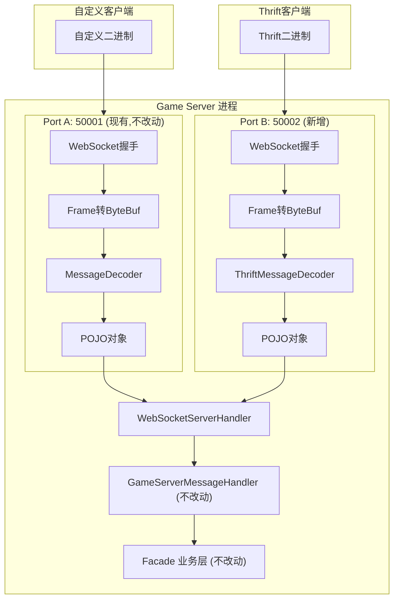

---
name: Thrift协议转换器
overview: 在 slg-net 中新增 Thrift 协议适配层，通过独立 WebSocket 端口接收 Thrift 客户端连接，将 Thrift 二进制消息转换为现有 POJO 对象，复用全部业务逻辑，对现有代码零侵入。
todos:
  - id: deps
    content: 新增 libthrift 依赖：根 pom.xml (dependencyManagement) + slg-net/pom.xml (optional) + slg-game/pom.xml
    status: pending
  - id: converter-framework
    content: 创建转换器框架：IThriftConverter 接口、ThriftConverterRegistry 注册中心、ReflectiveThriftConverter 通用反射转换器
    status: pending
  - id: thrift-mapping
    content: 创建 thrift-mapping.yml 映射配置文件，定义 Thrift msgId/class 与 POJO class 的映射关系
    status: pending
  - id: codec
    content: 实现 ThriftMessageDecoder (ByteToMessageDecoder) 和 ThriftMessageEncoder (MessageToByteEncoder)
    status: pending
  - id: pipeline
    content: 创建 ThriftWebSocketChannelInitializer，组装 Thrift Pipeline（复用 WebSocket 帧处理，替换编解码器）
    status: pending
  - id: server-refactor
    content: 改造 WebSocketServer 支持自定义 ChannelInitializer 参数（新增构造函数重载，向后兼容）
    status: pending
  - id: spring-config
    content: 创建 Spring 配置：EnableThriftAdapter 注解、ThriftAdapterProperties、ThriftAdapterConfiguration、ThriftAdapterLifeCycleConfiguration
    status: pending
  - id: lifecycle-phase
    content: 在 LifecyclePhase 中新增 THRIFT_ADAPTER 常量
    status: pending
  - id: game-integration
    content: 在 GameMain 添加 @EnableThriftAdapter 注解，在 application.yml 添加 thrift.adapter 配置
    status: pending
  - id: generated-classes
    content: 放置 Thrift IDL 生成的 Java 类到 com.slg.net.thrift.generated 包
    status: pending
isProject: false
---

# Thrift 协议转换器实施计划

## 架构概览

由于 Thrift 客户端也使用 WebSocket 传输，两种客户端共享相同的 WebSocket 握手和帧处理层，仅消息体编解码不同。方案在 `slg-net` 中新增 `com.slg.net.thrift` 包，通过 `@EnableThriftAdapter` 注解按需启用，遵循现有 `@EnableRpcServer` / `@EnableWebSocketServer` 的设计模式。




## 对现有代码的影响分析


| 文件/模块                          | 改动类型                 | 影响                       |
| ------------------------------ | -------------------- | ------------------------ |
| slg-net/pom.xml                | 新增 optional 依赖       | libthrift，optional 不传递   |
| 根 pom.xml                      | dependencyManagement | 仅版本声明                    |
| slg-common/LifecyclePhase.java | 新增常量                 | 1 行                      |
| slg-game/GameMain.java         | 新增注解                 | 1 行 @EnableThriftAdapter |
| slg-game/application.yml       | 新增配置段                | thrift.adapter.*         |
| 全部 Facade/Handler/业务代码         | **无改动**              | 零侵入                      |


**新增文件全部在 `slg-net/src/main/java/com/slg/net/thrift/` 下。**

---

## 第一步：新增依赖

### 1.1 根 [pom.xml](pom.xml) — dependencyManagement 新增 Thrift 版本

```xml
<thrift.version>0.20.0</thrift.version>
```

```xml
<dependency>
    <groupId>org.apache.thrift</groupId>
    <artifactId>libthrift</artifactId>
    <version>${thrift.version}</version>
</dependency>
```

### 1.2 [slg-net/pom.xml](slg-net/pom.xml) — optional 依赖

```xml
<dependency>
    <groupId>org.apache.thrift</groupId>
    <artifactId>libthrift</artifactId>
    <optional>true</optional>
</dependency>
```

### 1.3 [slg-game/pom.xml](slg-game/pom.xml) — 显式引入（使用时）

```xml
<dependency>
    <groupId>org.apache.thrift</groupId>
    <artifactId>libthrift</artifactId>
</dependency>
```

---

## 第二步：Thrift 生成类放置

将客户端 IDL 文件用 `thrift --gen java` 生成的 Java 类放入：

```
slg-net/src/main/java/com/slg/net/thrift/generated/
    ├── TLoginReq.java
    ├── TLoginResp.java
    ├── TEnterScene.java
    └── ...
```

这些类由 Thrift 编译器自动生成，均继承 `org.apache.thrift.TBase`。放在 slg-net 中是因为它们属于协议层（与 `clientmessage/packet/` 中的 POJO 对应）。

---

## 第三步：转换器框架（`com.slg.net.thrift.converter`）

### 3.1 `IThriftConverter.java` — 转换器接口

```java
public interface IThriftConverter<T extends TBase<?, ?>, R> {
    R fromThrift(T thriftMsg);     // 入站：Thrift → POJO
    T toThrift(R pojoMsg);         // 出站：POJO → Thrift
    Class<T> getThriftType();      // Thrift 类型
    Class<R> getPojoType();        // POJO 类型
}
```

### 3.2 `ThriftConverterRegistry.java` — 转换器注册中心

维护三组映射：

- `thriftMsgId(int) → IThriftConverter`（入站：根据消息ID查转换器）
- `pojoClass → IThriftConverter`（出站：根据 POJO 类型查转换器）
- `internalProtocolId → thriftMsgId`（协议号互转）

启动时从 `thrift-mapping.yml` 加载映射配置，自动创建 `ReflectiveThriftConverter` 实例。手动注册的 `IThriftConverter` Bean 优先级高于自动映射。

### 3.3 `ReflectiveThriftConverter.java` — 通用反射转换器

基于字段名自动映射 Thrift Struct 和 POJO，适用于**字段名一致**的协议（大部分游戏协议均如此）。内部使用 `MethodHandle` 缓存访问器，运行时零反射。

### 3.4 `thrift-mapping.yml` — 映射配置文件

放在 `slg-net/src/main/resources/thrift-mapping.yml`：

```yaml
thrift-mappings:
  login:
    - thriftMsgId: 1001
      thriftClass: com.slg.net.thrift.generated.TLoginReq
      pojoClass: com.slg.net.message.clientmessage.login.packet.CM_LoginReq

    - thriftMsgId: 1002
      thriftClass: com.slg.net.thrift.generated.TLoginResp
      pojoClass: com.slg.net.message.clientmessage.login.packet.SM_LoginResp

  scene:
    - thriftMsgId: 1100
      thriftClass: com.slg.net.thrift.generated.TEnterScene
      pojoClass: com.slg.net.message.clientmessage.scene.packet.CM_EnterScene
```

`thriftMsgId` 可以与现有 `message.yml` 的 protocolId 一致（如果客户端也使用相同的 ID），也可以不同（转换器会自动映射）。

---

## 第四步：编解码器（`com.slg.net.thrift.codec`）

### 4.1 `ThriftMessageDecoder.java` — 入站解码器

继承 `ByteToMessageDecoder`，替代现有 `MessageDecoder` 在 Thrift Pipeline 中的位置。

**消息帧格式**（需与客户端确认，以下为最常见的游戏协议格式）：

```
+---------------+-------------------+
| MsgId (4字节)  | Thrift Body       |
+---------------+-------------------+
| int32 BE      | TCompact/TBinary  |
+---------------+-------------------+
```

解码流程：

1. 从 ByteBuf 读取 4 字节 `msgId`
2. 根据 `msgId` 从 `ThriftConverterRegistry` 获取转换器
3. 实例化对应的 Thrift TBase 对象
4. 用 `TBinaryProtocol`（或 `TCompactProtocol`）从剩余 ByteBuf 反序列化
5. 调用 `converter.fromThrift(thriftObj)` 得到 POJO
6. 将 POJO 传递给下一个 Handler

### 4.2 `ThriftMessageEncoder.java` — 出站编码器

继承 `MessageToByteEncoder<Object>`，替代现有 `MessageEncoder`。

编码流程：

1. 根据 POJO 类型从 `ThriftConverterRegistry` 获取转换器
2. 调用 `converter.toThrift(pojo)` 得到 Thrift TBase 对象
3. 用 `TBinaryProtocol` 序列化到临时 buffer
4. 写入 `msgId(4字节) + Thrift二进制`

---

## 第五步：Pipeline 和服务器（`com.slg.net.thrift.server`）

### 5.1 `ThriftWebSocketChannelInitializer.java`

仿照 [WebSocketServerChannelInitializer.java](slg-net/src/main/java/com/slg/net/socket/server/WebSocketServerChannelInitializer.java)，差异仅在编解码器：

```
入站: HttpServerCodec → ChunkedWriteHandler → HttpObjectAggregator
     → [IdleStateHandler] → WebSocketServerProtocolHandler
     → WebSocketFrameToByteBufDecoder    // 复用现有
     → ThriftMessageDecoder              // 替代 MessageDecoder
出站: ThriftMessageEncoder               // 替代 MessageEncoder
     → ByteBufToWebSocketFrameEncoder    // 复用现有
业务: WebSocketServerHandler             // 完全复用现有
```

服务器实例直接复用 [WebSocketServer](slg-net/src/main/java/com/slg/net/socket/server/WebSocketServer.java)，只需传入不同的 `ChannelInitializer`。为此需要将 `WebSocketServer` 的构造函数增加一个 `ChannelInitializer` 参数（或使用工厂方法）。

**对 WebSocketServer 的改动**：新增一个可选的 `ChannelHandler childHandler` 构造参数，使其支持自定义 Pipeline。当不传时默认使用 `WebSocketServerChannelInitializer`（向后兼容）。

---

## 第六步：Spring 配置（`com.slg.net.thrift.config`）

### 6.1 `ThriftAdapterProperties.java`

```java
@ConfigurationProperties(prefix = "thrift.adapter")
@Getter @Setter
public class ThriftAdapterProperties {
    private boolean enabled = false;
    private int port = 50002;
    private String path = "/ws";
    private String protocol = "binary";   // binary / compact
    private int bossThreads = 1;
    private int workerThreads = 2;
    private int readerIdleTime = 60;
}
```

### 6.2 `ThriftAdapterConfiguration.java`

仿照 [RpcServerConfiguration.java](slg-net/src/main/java/com/slg/net/rpc/config/RpcServerConfiguration.java)：

```java
@Configuration
@EnableConfigurationProperties(ThriftAdapterProperties.class)
@Import(WebSocketConnectionManagerConfiguration.class)
public class ThriftAdapterConfiguration {
    @Bean
    public ThriftConverterRegistry thriftConverterRegistry() { ... }

    @Bean("thriftServer")
    public WebSocketServer thriftServer(
            ThriftAdapterProperties props,
            ThriftConverterRegistry registry,
            WebSocketConnectionManager connectionManager,
            @Qualifier("webSocketServerMessageHandler") WebSocketMessageHandler messageHandler) {
        // 构建 ThriftWebSocketChannelInitializer
        // 创建 WebSocketServer 实例
    }
}
```

### 6.3 `ThriftAdapterLifeCycleConfiguration.java`

```java
@Configuration
public class ThriftAdapterLifeCycleConfiguration {
    @Bean
    public SmartLifecycle thriftServerLifeCycle(
            @Qualifier("thriftServer") WebSocketServer thriftServer) {
        // phase = LifecyclePhase.THRIFT_ADAPTER (紧跟 WEBSOCKET_SERVER)
    }
}
```

### 6.4 `EnableThriftAdapter.java`（`com.slg.net.thrift.anno`）

```java
@Target(ElementType.TYPE)
@Retention(RetentionPolicy.RUNTIME)
@Import({
    ThriftAdapterConfiguration.class,
    ThriftAdapterLifeCycleConfiguration.class
})
public @interface EnableThriftAdapter {}
```

---

## 第七步：对现有文件的具体改动

### 7.1 [WebSocketServer.java](slg-net/src/main/java/com/slg/net/socket/server/WebSocketServer.java) — 支持自定义 ChannelInitializer

新增构造函数重载，接收自定义的 `ChannelInitializer<SocketChannel>`。原有构造函数保持不变（向后兼容），内部默认创建 `WebSocketServerChannelInitializer`。

改动量约 15 行，不影响现有调用点。

### 7.2 [LifecyclePhase.java](slg-common/src/main/java/com/slg/common/constant/LifecyclePhase.java) — 新增常量

```java
int THRIFT_ADAPTER = Integer.MAX_VALUE - 100;
```

位于 `WEBSOCKET_SERVER` 之前，确保 Thrift 端口在游戏 WebSocket 端口之前准备好。

### 7.3 [GameMain.java](slg-game/src/main/java/com/slg/game/GameMain.java) — 新增注解

```java
@EnableThriftAdapter  // 新增此行
public class GameMain { ... }
```

### 7.4 slg-game/src/main/resources/application.yml — 新增配置段

```yaml
thrift:
  adapter:
    enabled: true
    port: 50002
    path: /ws
    protocol: binary
```

---

## 新增文件清单

```
slg-net/src/main/java/com/slg/net/thrift/
├── anno/
│   └── EnableThriftAdapter.java
├── codec/
│   ├── ThriftMessageDecoder.java
│   └── ThriftMessageEncoder.java
├── config/
│   ├── ThriftAdapterConfiguration.java
│   ├── ThriftAdapterLifeCycleConfiguration.java
│   └── ThriftAdapterProperties.java
├── converter/
│   ├── IThriftConverter.java
│   ├── ThriftConverterRegistry.java
│   └── ReflectiveThriftConverter.java
├── generated/
│   └── (Thrift IDL 生成的 Java 类)
└── server/
    └── ThriftWebSocketChannelInitializer.java

slg-net/src/main/resources/
└── thrift-mapping.yml
```

---

## 后期退出策略

当所有客户端迁移到自定义协议后：

1. 从 GameMain.java 移除 `@EnableThriftAdapter`
2. 从 application.yml 移除 `thrift.adapter` 配置
3. 删除 `com.slg.net.thrift` 整个包
4. 从 pom.xml 移除 libthrift 依赖
5. 从 LifecyclePhase 移除 `THRIFT_ADAPTER` 常量

全部改动集中在独立包内，无残留。