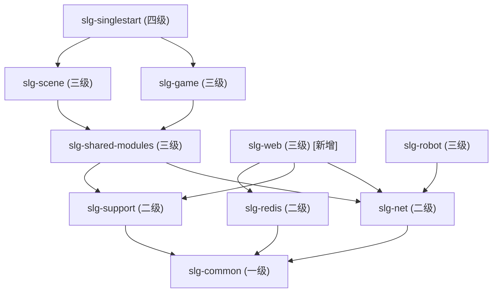
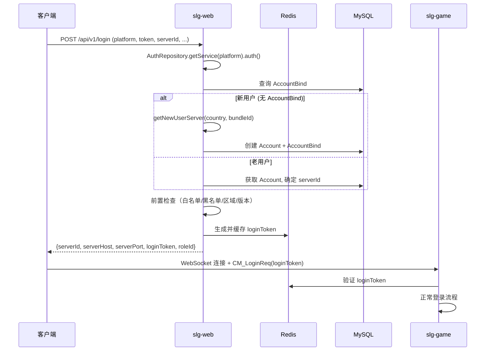
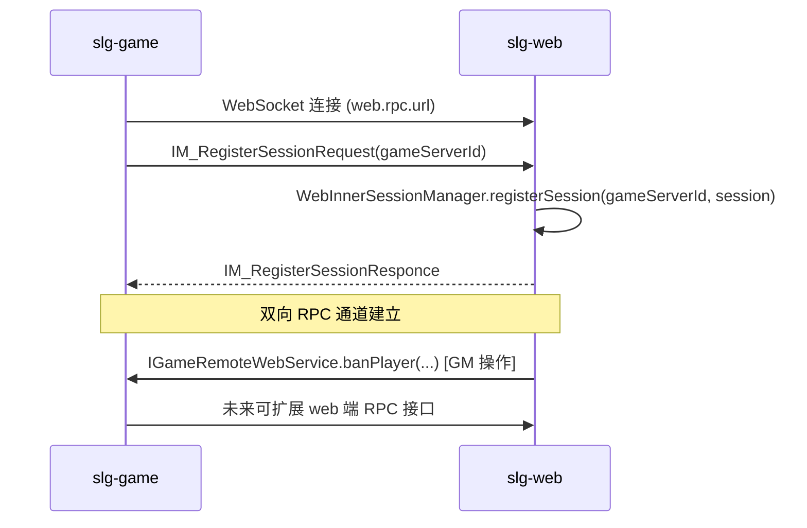

# 导量服（slg-web）模块新增方案

## 一、可行性分析

### 参考代码分析

参考代码 `导量服/icefire-web` 是基于传统 Spring MVC + WAR 部署的 Web 应用，核心功能：

- 客户端 HTTP 登录认证（多平台 SDK 认证）
- 账号管理（Account、AccountBind 的创建/绑定/解绑）
- game 服分配（新用户推荐服、老用户原服、导量策略）
- GM 后台管理（33 个 Controller、66+ 个 Service、50+ 个 JSP 页面）
- 辅助 API（版本查询、公告、订单等）

### 外部依赖对比

| 依赖 | 参考代码 | 当前项目 | 适配方案 |
|------|---------|---------|---------|
| Web 框架 | Spring MVC (WAR) | Spring Boot (无 Web) | 新增 spring-boot-starter-web |
| 数据库 | MySQL + MyBatis | MySQL + JPA (slg-support) | 用 JPA 实体（BaseMysqlEntity）替代 MyBatis Mapper |
| 缓存/锁 | Redis (Jedis) | slg-redis 模块（RedisTemplate + CacheAccessor） | 直接使用 RedisTemplate 操作 loginToken（见特殊说明） |
| 服务发现 | Zookeeper (ConfigCenter) | slg-net @EnableZookeeper + ZKConfig | 直接复用 ZKConfig 获取服务器列表与导量配置 |
| RPC | GzRpcServer (自有框架) | WebSocket RPC (slg-net) | 复用现有 RPC 框架 |
| 客户端认证 | 平台 SDK | 无 | 移植 IAuthService 框架 |
| GM 认证 | Shiro | 无 | 移植 Shiro（首期），Spring Security 作为后备方案 |
| GM 前端 | JSP | 无 | 保留 JSP（首期），Thymeleaf 作为后备方案 |

### 可复用的项目基础设施

- **Spring Boot 3.3.0**：启动框架
- **MySQL + JPA + EntityCache** ([slg-support/pom.xml](slg-support/pom.xml))：持久化 Account、AccountBind 等实体（`BaseMysqlEntity` + `BaseMysqlRepository` + `@Serialized` JSON 列）
- **RPC 框架** ([slg-net/.../rpc/](slg-net/src/main/java/com/slg/net/rpc/))：与 game 服通信
- **Zookeeper** ([slg-net/.../zookeeper/](slg-net/src/main/java/com/slg/net/zookeeper/))：`ZKConfig` 已包含所有 GameServer 信息（`GameServerZkInfo`，含导量配置 `diversionConfig`、`diversionSwitch`、`multiRoleServerShow`），通过 `ZookeeperShareService` 加载/监听/增量更新，`@EnableZookeeper` 一键启用
- **Redis** ([slg-redis/](slg-redis/))：`RedisTemplate`（JSON 序列化）+ `CacheAccessor`（字段级缓存），Maven 引入即自动启用
- **SmartLifecycle** ([LifecyclePhase.java](slg-common/src/main/java/com/slg/common/constant/LifecyclePhase.java))：启动顺序控制
- **虚拟线程执行器**：Executor.System / Executor.Player 等
- **协议框架**：message.yml + MessageHandler
- **配置表框架**：TableManager（如需配置导量规则表）

### 结论：**完全可行**，核心业务逻辑可保持不变，ZK 和 Redis 基础设施已就绪，主要工作是适配数据层和业务移植。

---

## 二、模块定位与依赖层级



`slg-web` 与 `slg-game`/`slg-scene` 同级（三级模块），依赖 `slg-net`（含 RPC + Zookeeper） + `slg-support`（含 MySQL/JPA） + `slg-redis`（含 RedisTemplate），**不依赖** `slg-shared-modules`/`slg-game`/`slg-scene`。

---

## 三、模块结构

### 3.1 Maven 配置 ([slg-web/pom.xml](slg-web/pom.xml))

```xml
<dependencies>
    <!-- Spring Boot -->
    <dependency> spring-boot-starter                 </dependency>
    <dependency> spring-boot-starter-web             </dependency>  <!-- HTTP REST + MVC -->

    <!-- MySQL + JPA（配合 @EnableMysql 使用） -->
    <dependency> spring-boot-starter-data-jpa        </dependency>
    <dependency> mysql-connector-j                   </dependency>

    <!-- JSP 支持 -->
    <dependency> tomcat-embed-jasper                 </dependency>
    <dependency> jakarta.servlet.jsp.jstl            </dependency>

    <!-- Shiro 安全框架（Spring Boot 3 需要 Shiro 2.0+ jakarta 版本） -->
    <dependency> shiro-spring-boot-web-starter 2.0+  </dependency>  <!-- 须使用 jakarta classifier -->

    <!-- 内部模块 -->
    <dependency> slg-support                         </dependency>
    <dependency> slg-net                             </dependency>  <!-- 含 RPC、Zookeeper、协议框架 -->
    <dependency> slg-redis                           </dependency>  <!-- Redis 缓存（loginToken 等） -->
</dependencies>
```

打包方式：`war`（JSP 需要 WAR 包支持）或 `jar`（使用 `tomcat-embed-jasper` 嵌入式支持）。

注意：`@EnableMongo` 和 `@EnableMysql` 不可同时使用，`slg-web` 使用 `@EnableMysql`。`slg-redis` 通过 Maven 依赖引入即自动启用，无需 `@Enable` 注解。`@EnableZookeeper` 在启动类上标注即可启用 ZK 配置读取。

### 3.2 包结构

```
slg-web/src/main/java/com/slg/web/
├── WebMain.java                          # 启动类
├── core/
│   ├── lifecycle/
│   │   └── WebInitLifeCycle.java         # Web 业务初始化生命周期
│   ├── config/
│   │   └── WebMvcConfig.java             # Spring MVC 配置（拦截器、CORS、视图解析等）
│   └── interceptor/
│       └── LogInterceptor.java           # 请求日志拦截器
│
│  ==================== 客户端 API ====================
├── account/
│   ├── controller/
│   │   ├── BaseAccountController.java    # 账号接口基类
│   │   └── AccountController.java        # 多角色登录实现
│   ├── entity/
│   │   ├── AccountEntity.java            # 账号实体（JPA @Entity，继承 BaseMysqlEntity）
│   │   └── AccountBindEntity.java        # 账号绑定实体（JPA @Entity）
│   └── service/
│       ├── AccountService.java           # 账号 CRUD
│       └── AccountBindService.java       # 绑定 CRUD
├── auth/
│   ├── IAuthService.java                 # 平台认证接口
│   ├── IAuthContext.java                 # 认证上下文接口
│   ├── AuthRepository.java              # 认证服务注册中心
│   └── impl/
│       ├── VisitorAuthService.java       # 游客认证
│       ├── TuyooAuthService.java         # 途游 SDK 认证
│       └── AppleAuthService.java         # Apple 认证
├── server/
│   ├── service/
│   │   ├── IServerService.java           # 服务器管理接口
│   │   └── ServerServiceImpl.java        # 服务器管理实现（数据来源 ZKConfig）
│   └── manager/
│       └── ServerConfigManager.java      # 服务器配置管理（封装 ZKConfig 查询 + 导量写入）
├── api/
│   └── ApiController.java               # 其他 API（版本、公告等）
│
│  ==================== GM 后台 ====================
├── gm/
│   ├── shiro/
│   │   ├── AuthRealm.java               # Shiro 认证授权 Realm
│   │   ├── FilterChainDefinitionMapBuilder.java  # 过滤器链定义
│   │   ├── ShiroConfig.java             # Shiro Spring Boot 配置（替代 XML）
│   │   ├── ShiroUtils.java              # 密码工具
│   │   └── filter/
│   │       ├── AjaxFormAuthenticationFilter.java
│   │       ├── AjaxRolesAuthorizationFilter.java
│   │       ├── AjaxPermissionsAuthorizationFilter.java
│   │       └── ShiroFilterUtils.java
│   ├── entity/
│   │   ├── AdminEntity.java             # 管理员实体（JPA @Entity）
│   │   ├── SysRoleEntity.java           # 系统角色实体（JPA @Entity）
│   │   ├── SysAclEntity.java            # 系统权限实体（JPA @Entity）
│   │   └── ...                          # Billboard、CDKeyInfo、Email 等 GM Model
│   ├── controller/
│   │   ├── LoginController.java         # GM 登录/登出
│   │   ├── ServerController.java        # 服务器管理（对应 ServerEntityController）
│   │   ├── RoleController.java          # 玩家信息/封号/禁言
│   │   ├── EmailController.java         # 邮件管理
│   │   ├── NoticeController.java        # 公告/跑马灯
│   │   ├── BillboardController.java     # 游戏公告
│   │   ├── HealthController.java        # 服务健康检查
│   │   ├── CDKeyController.java         # CDKey 管理
│   │   ├── UpdateRoleDataController.java  # 玩家数据修改
│   │   ├── SystemCommandController.java   # 系统命令
│   │   ├── MigrateServerController.java   # 迁服
│   │   ├── RefundOrderController.java     # 退款订单
│   │   ├── KvkController.java             # KVK 控制
│   │   ├── GVGServerController.java       # GVG 控制
│   │   └── ...                            # 其余 Controller
│   └── service/
│       ├── AdminService.java            # 管理员 CRUD
│       ├── WebRPCService.java           # GM -> game 服 RPC 通信
│       ├── BillboardService.java        # 公告服务
│       ├── CDKeyService.java            # CDKey 服务
│       ├── RefundOrderService.java      # 退款服务
│       ├── DiversionService.java        # 导量服务（自动导量定时任务 + GM 导量配置操作）
│       └── ...                          # 其余 Service
│
│  ==================== 公共 ====================
├── rpc/
│   └── WebRpcRouteService.java          # Web 服 RPC 路由实现
├── response/
│   ├── Response.java                     # 统一响应封装
│   └── ErrorCode.java                   # 错误码定义
└── utils/
    └── TokenUtils.java                   # Token 生成工具

slg-web/src/main/webapp/                  # JSP + 静态资源
├── WEB-INF/
│   └── jsp/
│       ├── login.jsp
│       ├── nav.jsp
│       └── console/
│           ├── index.jsp                # 控制台首页
│           ├── server.jsp               # 服务器管理
│           ├── roleinfo.jsp             # 玩家信息
│           ├── chatmonitoring.jsp       # 聊天监控
│           ├── systememail.jsp          # 系统邮件
│           ├── notice.jsp               # 公告
│           ├── billboard.jsp            # 游戏公告
│           ├── health.jsp               # 服务状态
│           └── ...                      # 其余 JSP
└── pstatic/
    ├── css/
    ├── js/
    └── images/
```

### 3.3 启动类 (WebMain.java)

```java
@SpringBootApplication
@ComponentScan(basePackages = {
    "com.slg.common",             // 通用工具
    "com.slg.entity",             // 数据库对接框架
    "com.slg.table",              // 配置表框架
    "com.slg.web",                // 导量服业务 + GM 后台
    "com.slg.net.message",        // 协议解析
    "com.slg.net.rpc",            // RPC 框架
    "com.slg.net.zookeeper",      // Zookeeper 配置与服务器注册
    "com.slg.redis"               // Redis 缓存
})
@EnableRpcServer              // 开启 RPC 服务端（接收 game 服注册）
@EnableMysql                  // 开启 MySQL 数据库
@EnableZookeeper              // 开启 Zookeeper（读取 GameServer 列表 + 导量配置）
public class WebMain { ... }
```

与 [GameMain.java](slg-game/src/main/java/com/slg/game/GameMain.java) 对比：

- **不需要** `@EnableWebSocketServer`（客户端用 HTTP 连接，不是 WebSocket）
- **不需要** `@EnableWebSocketClient`（不主动连接其他服）
- **保留** `@EnableRpcServer`（game 服通过 RPC 主动连接 web 服）
- **使用** `@EnableMysql`（替代 game/scene 的 `@EnableMongo`，因为导量服数据更适合关系型数据库，且与参考代码保持一致）
- **新增** `@EnableZookeeper`（读取 ZK 中的 GameServer 列表、导量配置、服务器存活状态）
- **自动启用** `slg-redis`（通过 Maven 依赖引入，无需注解）

---

## 四、核心业务逻辑适配

### 4.1 登录流程（保持与参考代码一致）



### 4.1.1 Redis loginToken 存储方案（特殊说明：直接使用 RedisTemplate）

loginToken 的 Redis 操作**直接使用 `RedisTemplate`**，而不是通过项目的 `CacheAccessor` 体系。原因：

1. **loginToken 是临时性短生存周期数据**（TTL 30 秒~5 分钟），不属于 `CacheAccessor` 设计的实体级字段缓存场景
2. **需要原子性 TTL 设置**：`set(key, value, timeout)` 一步完成，`CacheAccessor` 基于 Hash 结构不支持 key 级 TTL
3. **跨进程共享**：web 服写入、game 服读取验证，仅需简单的 KV 读写，不需要字段级缓存
4. **操作极其简单**：仅 `set` + `get` + `delete`，无需 CacheAccessor 的批量/字段级能力

Redis Key 格式：`login:token:{tokenValue}`，Value 为 JSON（含 accountId、serverId、roleId 等），TTL 默认 5 分钟。

```java
// slg-web 端：生成并缓存 loginToken
String token = TokenUtils.generateToken();
String key = "login:token:" + token;
redisTemplate.opsForValue().set(key, JsonUtil.toJson(tokenInfo), 5, TimeUnit.MINUTES);

// slg-game 端：验证 loginToken（LoginService 中）
// 使用 GETDEL 保证原子性（Redis 6.2+），避免并发请求重复消费同一 token
String key = "login:token:" + loginToken;
String json = redisTemplate.opsForValue().getAndDelete(key);
if (json != null) {
    // 解析 tokenInfo，继续登录流程
}
```

> **原子性保证**：验证时使用 `getAndDelete()`（对应 Redis GETDEL 命令，Redis 6.2+），单条命令完成读取 + 删除，防止并发登录时同一 token 被重复消费。如果 Redis 版本低于 6.2，可改用 Lua 脚本实现原子 get+delete。

> **注意**：这是项目中 `RedisTemplate` 直接使用的特例。其他业务场景的 Redis 缓存仍应通过 `CacheAccessor` 操作，遵循 `slg-redis` 模块规范。

### 4.2 数据实体适配

参考代码使用 MySQL + MyBatis Mapper，适配为 MySQL + JPA（[BaseMysqlEntity](slg-support/src/main/java/com/slg/entity/mysql/entity/BaseMysqlEntity.java) + [BaseMysqlRepository](slg-support/src/main/java/com/slg/entity/mysql/repository/BaseMysqlRepository.java)）：

- **AccountEntity**：对应 `Account.java`，继承 `BaseMysqlEntity<Long>`，字段保持一致（id, mainRoleId, createTime, lastLoginTime, country, channel 等）
- **AccountBindEntity**：对应 `AccountBind.java`，继承 `BaseMysqlEntity<Long>`，字段保持一致（id, platformId, platform, accId, bindTime 等）
- **AdminEntity**：GM 管理员，继承 `BaseMysqlEntity<Long>`（id, userName, password, salt, roles, permissions 等）
- 使用 `@Entity` + `@Table` 注解，复杂字段使用 `@Serialized` 注解实现 JSON 序列化存储
- 服务层通过 `BaseMysqlRepository`（EntityManager）做 CRUD，或直接使用 `EntityCache` 做内存缓存 + 异步持久化

示例：

```java
@Data
@EqualsAndHashCode(callSuper = true)
@Entity
@Table(name = "account")
public class AccountEntity extends BaseMysqlEntity<Long> {
    private Long mainRoleId;
    private String advertisingId;
    private LocalDateTime lastLoginTime;
    private String country;
    private String channel;
    private String ip;
    // ...
}
```

### 4.3 认证框架移植

直接移植参考代码的认证架构：

- `IAuthService` 接口定义 `auth(id, token)` 方法
- `AuthRepository` 通过 `@PostConstruct` 自动扫描所有实现类，按 platform 映射
- 各平台实现类逐个移植（VisitorAuth、TuyooAuth、AppleAuth 等）

### 4.4 服务器管理（直接使用 ZKConfig）

`ServerServiceImpl` 核心逻辑保持不变：

- `getBestRecommendServer(country, bundleId)` - 推荐服选择
- `getNewUserServer()` - 新用户分配
- `getGameServerList()` - 获取服务器列表

数据来源从参考代码的 `ConfigCenter.getLsConfig()` 改为直接使用项目已有的 ZK 基础设施：

- 注入 `ZKConfig`，通过 `zkConfig.getAllGameServers()` 获取所有 `GameServerZkInfo` 列表
- `GameServerZkInfo` 已包含导量所需的全部字段：`diversionConfig`（导量配置 JSON）、`diversionSwitch`（导量开关 close/open/auto）、`multiRoleServerShow`（多角色服显示）
- 服务器存活检测通过 `GameServerZkInfo.isAlive()` 判断（基于 ZK 临时节点）
- 服务器启用/列表可见通过 `isEnable()` / `isInServerList()` 判断
- ZK 数据在 `ZookeeperShareService.loadAll()` 时一次性加载，后续通过 `watchAll()` 增量更新，业务层读 `ZKConfig` 即可，无需额外缓存
- 导量配置变更（如 GM 后台修改导量开关）通过 `ZookeeperShareService.writeGameServerField(serverId, ZkPath.DIVERSION_SWITCH, value)` 写入 ZK，watcher 自动同步到本地 `ZKConfig`

对应关系：

| 参考代码 ConfigCenter 方法 | 新项目对应方式 |
|--------------------------|--------------|
| `getLsConfig()` | `zkConfig.getAllGameServers()` |
| `getServerConfig(serverId)` | `zkConfig.getGameServer(serverId)` |
| `setServerConfig(...)` | `zookeeperShareService.writeGameServerField(...)` |

### 4.5 生命周期

在 [LifecyclePhase.java](slg-common/src/main/java/com/slg/common/constant/LifecyclePhase.java) 中新增：

```java
int WEB_INIT = Integer.MAX_VALUE - 3500;  // Web 服独立进程使用，在 DATABASE/REDIS/ZOOKEEPER 之后、RPC_SERVER 之前
```

`WebInitLifeCycle` 负责：

- 确认 ZK 数据加载完成（`ZKConfig` 已有 GameServer 列表）
- 启动导量定时任务（如有）
- 标记服务就绪

---

## 五、GM 后台方案

### 5.1 Shiro 安全框架（保留，后备 Spring Security）

移植参考代码的 Shiro 架构，将 XML 配置改为 Spring Boot Java Config：

- **ShiroConfig.java**：替代 `spring-shiro.xml`，配置 `SecurityManager`、`ShiroFilterFactoryBean`
- **AuthRealm.java**：认证从 MyBatis `AdminMapper` 改为 JPA `AdminService`（通过 `BaseMysqlRepository` 查询）
- **FilterChainDefinitionMapBuilder.java**：动态权限链从 MyBatis `SysAcl` Mapper 改为 JPA 查询
- **Ajax 过滤器**：直接移植（AjaxFormAuthenticationFilter 等）

**版本兼容性**：Spring Boot 3.3.0 使用 Jakarta EE（`jakarta.servlet.*`），Shiro 1.x 不兼容。必须使用 **Shiro 2.0+**，依赖需带 `jakarta` classifier（参考代码 `icefire-web` 已使用 Shiro 2.0.1 jakarta 版本）。pom.xml 中 Shiro 依赖示例：

```xml
<dependency>
    <groupId>org.apache.shiro</groupId>
    <artifactId>shiro-spring-boot-web-starter</artifactId>
    <version>2.0.1</version>
    <classifier>jakarta</classifier>
</dependency>
```

**后备方案**：后续可替换为 Spring Security，使用 `@PreAuthorize` 注解替代 Shiro 的 `<shiro:hasPermission>` 标签。

### 5.2 GM 权限模型（JPA 实体，MySQL 存储）

| 实体 | 对应参考代码 | 核心字段 | 说明 |
|------|-------------|---------|------|
| AdminEntity | Admin | id, userName, password, salt, email, roles | 继承 BaseMysqlEntity，roles 用 `@Serialized` 存储 |
| SysRoleEntity | SysRole | id, name, description, permissions | 继承 BaseMysqlEntity |
| SysAclEntity | SysAcl | id, pname, url, description | 继承 BaseMysqlEntity |

### 5.3 GM Controller 分批移植

**首期（基础界面 —— 登录 + 服务器状态查看）**：

首期目标：GM 后台能登录，并查看所有 GameServer/SceneServer 的运行状态，**不需要 RPC 通信**，数据全部来自 ZKConfig。

| Controller | 对应参考代码 | 功能 | 数据来源 |
|------------|-------------|------|---------|
| LoginController | login.jsp + ShiroConfig | GM 登录/登出/密码修改 | MySQL (AdminEntity) |
| ServerController | ServerEntityController | 服务器列表、状态、存活、导量配置查看 | ZKConfig (GameServerZkInfo) |
| HealthController | HealthController | 服务健康检查 | ZKConfig (alive 状态) |

首期 JSP 页面：`login.jsp`、`nav.jsp`、`console/index.jsp`（控制台首页）、`console/server.jsp`（服务器管理）、`console/health.jsp`（服务状态）

ServerController 核心接口：

| 接口 | 说明 | 实现方式 |
|------|------|---------|
| GET /gm/server/list | 服务器列表（含状态/存活/注册角色数） | `zkConfig.getAllGameServers()`（首期不含在线人数，在线人数需二期心跳协议） |
| GET /gm/server/detail/{id} | 单个服务器详情 | `zkConfig.getGameServer(id)` |
| POST /gm/server/diversion | 修改导量开关 | `zookeeperShareService.writeGameServerField(...)` |

**二期（核心管理 —— 需要 RPC 通信）**：

| Controller | 对应参考代码 | 功能 |
|------------|-------------|------|
| RoleController | RoleController | 玩家信息查询、封号、禁言 |
| EmailController | EmailController | 系统/公告/玩家邮件 |
| NoticeController | NoticeController | 跑马灯公告 |
| BillboardController | BillboardController | 游戏公告管理 |

**三期（扩展功能）**：

| Controller | 对应参考代码 | 功能 |
|------------|-------------|------|
| CDKeyController | CDKeyController | CDKey 创建/兑换/作废 |
| UpdateRoleDataController | UpdateRoleDataController | 资源/物品/兵力/英雄修改 |
| SystemCommandController | SystemCommandController | 系统命令执行 |
| MigrateServerController | MigrateServerController | 迁服操作 |
| RefundOrderController | RefundOrderController | 退款订单 |
| KvkController | KvkController | KVK 控制 |
| GVGServerController | GVGServerController | GVG 控制 |
| QuestionnaireController | QuestionnaireController | 调查问卷 |
| AuditController | AuditController | 审批审核 |
| AvatarController | AvatarController | 头像审核 |

### 5.4 GM -> Game 服 RPC 通信（二期）

GM 后台的操作需要通过 RPC 发送到 game 服执行（如封号、发邮件、修改资源等）。

#### RPC 连接机制

WebSocket RPC 是**全双工**的：连接建立后，两端都可以互相发送 RPC 请求。因此 web 服不需要 `@EnableWebSocketClient`，只需要 `@EnableRpcServer` 接受 game 服连接。game 连上后，web 可以通过同一条连接反向调用 game 的 RPC 方法。

**连接方向**：Game 主动连接 Web（类似 Game 连 Scene 的方式）



#### Game 侧改动（二期需要）

- `application.yml` 新增 web 服连接配置：`server.game.bind-web-url: ws://127.0.0.1:8091/rpc`
- `InnerSessionManager` 或新增 `WebSessionManager`，在 `GAME_INIT` 阶段主动连接 web 服 RPC 端口
- 连接成功后发送 `IM_RegisterSessionRequest`，与连 scene 服逻辑一致

#### Web 侧实现

- **`WebInnerSessionManager`**：管理 game 服连接的会话，收到 `IM_RegisterSessionRequest` 后按 `gameServerId` 存储 `NetSession`
- **`WebRpcRouteService`**（实现 `IRouteSupportService`）：`getSessionByServerId(gameServerId)` 返回对应 game 服的会话
- **`application.yml`** 需配置：`rpc.client.route-service-class: com.slg.web.net.rpc.service.WebRpcRouteService`
- GM Controller -> WebRPCService -> `IGameRemoteWebService` RPC -> game 服对应处理器

> **首期（阶段一）不需要 RPC 通信**：ServerController 数据来源是 ZKConfig，无需与 game 服交互。RPC 通道在二期 GM 核心功能时才需要建立。

### 5.5 JSP 前端（保留，后备 Thymeleaf）

- 从参考代码直接复制 JSP 文件到 `slg-web/src/main/webapp/WEB-INF/jsp/`
- 复制静态资源到 `slg-web/src/main/webapp/pstatic/`
- Spring Boot 配置视图解析器：

```yaml
spring:
  mvc:
    view:
      prefix: /WEB-INF/jsp/
      suffix: .jsp
```

- JSP 中 Shiro 标签（`<shiro:hasPermission>`）保持不变
- 菜单结构（menu.jsp）保持不变

**后备方案**：后续可将 JSP 逐步替换为 Thymeleaf 模板，使用 `sec:authorize` 替代 `<shiro:hasPermission>`。

---

## 六、协议与 RPC

### 6.1 新增内部协议（slg-net message.yml）

在 `slg-net` 中定义 web 相关内部协议：

```yaml
# Web 模块 (120-129)
web:
  - 120, IM_GameServerRegister    # game 服连接 web 服后的会话注册（复用现有 IM_RegisterSessionRequest 即可）
  - 121, IM_GameServerHeartbeat   # game 服定时上报运行时数据（在线人数等，ZK 中不存储的高频变化数据）
```

**协议用途说明**：

- **IM_GameServerRegister**：实际可复用现有的 `IM_RegisterSessionRequest`/`IM_RegisterSessionResponce`（协议号 111/112），无需新增协议。Game 连接 Web 后发送注册请求，Web 记录 serverId -> session 映射。
- **IM_GameServerHeartbeat**：**必要协议**，用于传递 ZK 中**不存储**的高频运行时数据。`GameServerZkInfo` 只包含配置类信息（网络地址、导量配置、开服时间等），不包含在线人数等频繁变化的运行时状态。心跳协议由 Game 定时发送，Web 在内存中维护 `serverId -> RuntimeInfo`（含 onlineCount、lastHeartbeatTime 等），供 ServerController 展示。

> **注意**：如果首期 ServerController 不需要在线人数，可以只展示 ZK 中已有的静态信息（存活/启用/角色数等），心跳协议推迟到二期实现。

### 6.2 RPC 接口

在 `slg-net` 中定义 RPC 接口：

```java
// game 服提供给 web 服（GM 后台）调用（二期 GM 核心功能需要）
public interface IGameRemoteWebService {
    // 封号
    void banPlayer(long playerId, long duration, String reason);
    // 禁言
    void mutePlayer(long playerId, long duration, String reason);
    // 发邮件
    void sendMail(long playerId, String title, String content, String attachment);
    // 执行系统命令
    String executeCommand(String command, String params);
    // 修改玩家资源
    void modifyPlayerResources(long playerId, String resourceJson);
}
```

> **说明**：原计划的 `IWebRemoteService.verifyLoginToken()` 已移除。loginToken 验证改为 game 服直接通过 RedisTemplate 查询 Redis（web 服和 game 服共用同一 Redis 实例），无需 RPC 调用，降低延迟和复杂度。

### 6.3 配置文件 (application.yml)

```yaml
spring:
  application:
    name: slg-web-server
  datasource:
    url: jdbc:mysql://localhost:3306/slg_web?useUnicode=true&characterEncoding=utf-8&serverTimezone=Asia/Shanghai
    username: root
    password: xxx
    driver-class-name: com.mysql.cj.jdbc.Driver
  jpa:
    hibernate:
      ddl-auto: update
    show-sql: false
    properties:
      hibernate:
        format_sql: true
        dialect: org.hibernate.dialect.MySQLDialect
  mvc:
    view:
      prefix: /WEB-INF/jsp/
      suffix: .jsp
  # Redis 配置（与 slg-game 共用同一 Redis 实例，loginToken 跨进程共享）
  data:
    redis:
      host: 127.0.0.1
      port: 6379
      password:

server:
  port: 8090               # HTTP API + GM 后台端口

# RPC 配置
rpc:
  server:
    port: 8091              # 接收 game 服连接
  client:
    route-service-class: com.slg.web.net.rpc.service.WebRpcRouteService  # Web 端 RPC 路由（二期 GM RPC 通信需要）

# Zookeeper 配置（读取 GameServer 列表 + 导量配置）
zookeeper:
  connect-string: 127.0.0.1:2181
  session-timeout: 60000
  base-path: /slg
  retry:
    base-sleep-time: 1000
    max-retries: 3

# 配置表路径
table:
  path: table
```

> **重要**：Redis 配置必须与 slg-game 指向同一 Redis 实例，因为 loginToken 由 web 服写入、game 服读取验证。

---

## 七、与 game 服的集成改动

### 7.1 slg-game 侧

- `CM_LoginReq` 增加 `loginToken` 字段
- `LoginService.login()` 中增加 loginToken 验证逻辑：**直接通过 RedisTemplate.opsForValue().getAndDelete()** 原子读取并删除 `login:token:{tokenValue}`（Redis 6.2+ GETDEL 命令），无需 RPC 调用 web 服（slg-game 已依赖 slg-redis，与 web 服共用同一 Redis 实例）
- 新增 `IGameRemoteWebService` 实现类，处理来自 GM 后台的 RPC 请求（封号、邮件等）（二期）
- `application.yml` 新增 web 服 RPC 连接配置：`server.game.bind-web-url`（二期，GM RPC 通信需要）

### 7.2 slg-net 侧

- 新增 web 相关内部协议类（IM_GameServerRegister、IM_GameServerHeartbeat、IM_GameServerUnregister）
- 新增 RPC 接口定义（IGameRemoteWebService，二期 GM 核心功能需要）
- message.yml 注册新协议（120-129 范围）

---

## 八、实施顺序建议

```
阶段一：模块骨架 + GM 基础界面
├── create-module      (Maven 模块 + 启动类，含 @EnableMysql + @EnableRpcServer + @EnableZookeeper + slg-redis)
├── lifecycle-phase    (生命周期常量 + WebInitLifeCycle)
├── web-config         (MVC 配置 + application.yml，含 MySQL、Redis、ZK、RPC 配置)
├── response-utils     (Response + ErrorCode + TokenUtils)
├── gm-shiro           (Shiro 安全框架 + AdminEntity)
└── gm-basic-ui        (LoginController + ServerController + HealthController + 对应 JSP + 静态资源)
                       ServerController 数据来源 = ZKConfig，无 RPC 依赖

阶段二：客户端登录链路
├── entity-layer       (Account/AccountBind 实体)
├── auth-framework     (平台认证框架)
├── server-service     (ServerServiceImpl，基于 ZKConfig 的推荐服/导量逻辑)
├── account-controller (登录接口，loginToken 通过 RedisTemplate 缓存)
└── protocol-rpc       (内部协议 + RPC 接口定义)

阶段三：集成联调 + GM 核心功能
├── game-integration       (slg-game 侧 loginToken 验证 + IGameRemoteWebService 实现)
├── gm-core-controllers    (RoleController、EmailController、NoticeController、BillboardController)
├── gm-core-services       (WebRPCService、RoleService、EmailService、NoticeService 等)
└── gm-core-jsp            (玩家信息、邮件、公告等 JSP 页面)

阶段四：GM 扩展功能
└── gm-extended-controllers (CDKey、迁服、退款、KVK、GVG、资源修改等)
```

阶段一完成后即可启动 web 服，GM 管理员可登录后台查看服务器列表和状态，为后续开发提供可视化基础。

---

## 九、不纳入首期的功能

以下功能可后续按需添加：

- 支付/订单接口
- KVK 赛季服逻辑
- 微信相关功能（WXBizMsgCrypt 等）
- Prometheus 监控集成
- 头像上传/审核
- BI 跟踪/AppsFlyer 集成
- GeoIP / ip2region 地理定位（首期可简化处理）

---

## 十、后备技术方案

| 当前方案 | 后备方案 | 切换时机 |
|---------|---------|---------|
| JSP 前端 | Thymeleaf 模板 | 需要更好的模板引擎、更易维护时 |
| Shiro 认证 | Spring Security | 需要 OAuth2、JWT 等高级特性时 |
| MySQL + JPA | MongoDB (如需文档型存储) | 数据结构变动频繁、无需复杂查询时 |
