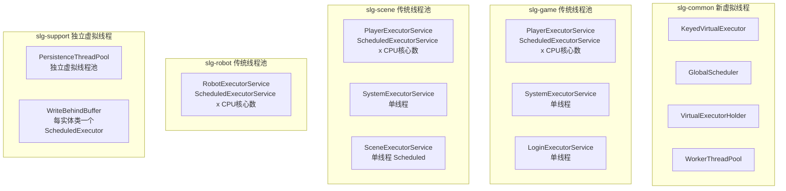

# 虚拟线程统一替换方案

## 一、现状分析

### 1.1 当前线程池分布



**共计约 `2*CPU核心数 + 6 + N` 个平台线程 + 2 个独立虚拟线程池**，存在资源碎片化问题。

### 1.2 目标架构

所有模块统一使用 `KeyedVirtualExecutor` + `GlobalScheduler`，仅保留 2 个平台调度线程 + 1 个共享虚拟线程池。

---

## 二、KeyedVirtualExecutor / GlobalScheduler 代码审查

### 2.1 发现的问题

**问题 1：TaskKey 队列内存泄漏**

`KeyedVirtualExecutor.java` 中 `queues` (ConcurrentHashMap) 只增不删。每个玩家登录会创建 `TaskKey.of(PLAYER, playerId)`，退出后 key 永远留在 map 中。

```java
// 第55行 - queues 只有 computeIfAbsent，没有 remove
private final ConcurrentHashMap<TaskKey, KeyedTaskQueue> queues = new ConcurrentHashMap<>();
```

**修复方案**：在 `drain()` 方法结束时，如果队列为空且没有新消费者启动，清理该 key：

```java
// drain 方法 finally 块中，kq.running.set(false) 之后：
if (kq.queue.isEmpty() && !kq.running.get()) {
    queues.remove(key, kq); // CAS 安全删除
}
```

**补充：定期清理兜底机制**

`drain()` 结束时的清理存在边缘情况：在 `kq.running.set(false)` 和 `queues.remove(key, kq)` 之间，可能有新任务到来并启动了新消费者，导致 CAS 比较失败，空队列残留。为此增加一个低频定期清理任务作为兜底：

```java
// KeyedVirtualExecutor 新增方法
public void cleanupIdleQueues() {
    queues.entrySet().removeIf(e -> {
        KeyedTaskQueue kq = e.getValue();
        return kq.queue.isEmpty() && !kq.running.get();
    });
}
```

在 `KeyedVirtualExecutor` 初始化时，通过 `GlobalScheduler` 注册定期清理（如每 5 分钟执行一次），确保长期运行不会积累大量空队列。

**问题 2：GlobalScheduler 的 scheduleWithFixedDelay 语义变化**

`GlobalScheduler.java` 的 `scheduleWithFixedDelay` 实际上只是 "到点后入队"，不会等待任务执行完成。与传统 `ScheduledExecutorService.scheduleWithFixedDelay`（等待上一次完成后再计时）语义不同。

```java
// 第187行 - execute() 只是入队，lambda 瞬间返回
scheduler.scheduleWithFixedDelay(() -> keyedVirtualExecutor.execute(module, task), ...)
```

**影响**：场景 Tick（`AoiTick`/`ArmyTick`）依赖 "完成后再延迟" 的语义。若 tick 执行超过间隔时间，任务会在队列中堆积。

**修复方案**：增加 `completionAwareSchedule` 方法，采用自递归调度模式：

```java
public ScheduledFuture<?> scheduleAfterComplete(TaskModule module, Runnable task, 
                                                  long initialDelay, long delay, TimeUnit unit) {
    // 任务完成后才调度下一次，保证不堆积
}
```

**问题 3：WorkerThreadPool 重复创建虚拟线程池**

`WorkerThreadPool.java` 自己创建了一个 `newVirtualThreadPerTaskExecutor()`，与 `VirtualExecutorHolder` 重复。

**修复方案**：改为注入 `VirtualExecutorHolder` 的共享执行器。

---

## 三、统一 Executor 架构设计

### 3.1 新增 ModuleExecutor（纯封装类）

在 `com.slg.common.executor` 包中新增 `ModuleExecutor` 类，封装 `KeyedVirtualExecutor` + `GlobalScheduler`，**不实现任何接口**，对外提供与现有调用方式完全一致的 API：

```java
public class ModuleExecutor {
    private final TaskModule module;
    
    // 多链执行（如 Player、Robot、Persistence）
    public void execute(long key, Runnable task) {
        KeyedVirtualExecutor.getInstance().execute(module, key, task);
    }
    
    // 单链执行（如 System、Login、Scene）
    public void execute(Runnable task) {
        KeyedVirtualExecutor.getInstance().execute(module, task);
    }
    
    // 线程判断
    public boolean inThread(long key) { ... }
    public boolean inThread() { ... }
    
    // 定时任务（代替原有的 ScheduledExecutorService）
    public ScheduledFuture<?> schedule(long key, Runnable task, long delay, TimeUnit unit) { ... }
    public ScheduledFuture<?> schedule(Runnable task, long delay, TimeUnit unit) { ... }
    public ScheduledFuture<?> scheduleWithFixedDelay(...) { ... }
    public ScheduledFuture<?> scheduleAtFixedRate(...) { ... }
}
```

### 3.2 统一 Executor 类（替代各模块的 Executor）

在 `com.slg.common.executor` 包中新增统一的 `Executor`：

```java
@Component
public class Executor {
    public static ModuleExecutor Player;
    public static ModuleExecutor System;
    public static ModuleExecutor Login;
    public static ModuleExecutor Scene;
    public static ModuleExecutor Persistence;
    public static ModuleExecutor Robot;
    
    @PostConstruct
    void init() {
        Player = new ModuleExecutor(TaskModule.PLAYER);
        System = new ModuleExecutor(TaskModule.SYSTEM);
        // ...
    }
}
```

### 3.3 增强 TaskModule

为 `TaskModule` 增加 `multiChain` 属性，区分多链/单链模块：

- PLAYER -- 多链，按 playerId 分链
- SYSTEM -- 单链，所有系统任务串行
- LOGIN -- 单链，所有登录任务串行
- SCENE -- 单链，所有场景任务串行
- PERSISTENCE -- 多链，按实体 ID 分链
- ROBOT -- 多链，按 robotId 分链

`ModuleExecutor.execute(long key, Runnable)` 内部根据 `multiChain` 决定是否使用 key。

---

## 四、完全移除 RPC 线程池体系，改为直接使用虚拟线程

### 4.1 设计思路

完全删除 `RpcExecutor`（抽象类）、`RpcExecutorService`（接口）、`RpcThread`（枚举）三个类。RPC 分发不再经过中间接口层，而是在 `RpcMethodMeta` 中直接存储 `TaskModule`，分发时直接调用 `KeyedVirtualExecutor`。

原链路（5 层间接）：

```
@RpcMethod.useThread 
  -> RpcMethodInjector 解析 
    -> RpcExecutor.getExecutor() 
      -> RpcMethodMeta.setExecutor(RpcExecutorService) 
        -> RpcThreadUtil.getExecutor() 
          -> RpcExecutorService.execute()
```

新链路（直达）：

```
@RpcMethod.useModule -> RpcMethodInjector 直接存 TaskModule -> KeyedVirtualExecutor.execute(module, key, task)
```

### 4.2 修改 @RpcMethod 注解

将 `@RpcMethod` 的 `useThread()` 改为 `useModule()`：

```java
// 修改前
RpcThread useThread() default RpcThread.Player;

// 修改后
TaskModule useModule() default TaskModule.PLAYER;
```

### 4.3 修改 RpcMethodMeta

`RpcMethodMeta` 存储 `TaskModule` 而非 `RpcExecutorService`：

```java
// 删除
private RpcExecutorService executor;

// 新增
private TaskModule taskModule;
```

### 4.4 大幅简化 RpcMethodInjector

`RpcMethodInjector` 不再需要注入 `RpcExecutor`，不再查找/验证线程池是否存在：

```java
// 修改前（需要 RpcExecutor 依赖，需要校验线程池不为 null）
RpcExecutorService executor = rpcExecutor.getExecutor(rpcMethod.useThread());
if (executor == null) { throw ... }
meta.setExecutor(executor);

// 修改后（直接存枚举，零依赖）
meta.setTaskModule(rpcMethod.useModule());
```

构造函数的 `@Lazy RpcExecutor rpcExecutor` 参数完全删除。

### 4.5 修改 RpcThreadUtil

`RpcThreadUtil` 新增 `dispatch` 方法，封装完整的 RPC 线程分派逻辑：

```java
public static void dispatch(IM_RpcRequest request, Runnable task) {
    RpcMethodMeta meta = RpcProxyManager.getInstance()
        .getRpcMethodMeta(request.getMethodMarker());
    TaskModule module = meta.getTaskModule();
    long key = extractThreadKey(meta, request.getParams());
    KeyedVirtualExecutor.getInstance().execute(module, key, task);
}
```

原有的 `getExecutor()` 方法删除。

### 4.6 简化 RPC 分发点

`GameHandlerUtil`、`SceneHandlerUtil`、`RpcServerMessageHandler` 的 RPC 请求处理统一简化为：

```java
// 修改前（3 步：取 executor、取 key、调用接口）
RpcExecutorService executorService = RpcThreadUtil.getExecutor(imRpcRequest);
long key = RpcThreadUtil.getThreadKey(imRpcRequest);
executorService.execute(key, () -> { method.invoke(bean, session, message); });

// 修改后（1 步：直接 dispatch）
RpcThreadUtil.dispatch(imRpcRequest, () -> { method.invoke(bean, session, message); });
```

### 4.7 完全删除的类

- `RpcExecutorService` -- 接口，不再需要
- `RpcExecutor` -- 抽象类，不再需要
- `RpcThread` -- 枚举，由 TaskModule 替代

### 4.8 更新 ISceneRpcService

`ISceneRpcService` 中所有 `@RpcMethod` 当前使用默认值（Player），属性名变更为 `useModule` 即可，无需修改注解值。

---

## 五、各模块线程池替换

### 5.1 业务代码调用方式对比（无变化）

| 场景 | 修改前 | 修改后 |
|------|--------|--------|
| 玩家任务 | `Executor.Player.execute(playerId, task)` | `Executor.Player.execute(playerId, task)` -- 不变 |
| 登录任务 | `Executor.Login.execute(task)` | `Executor.Login.execute(task)` -- 不变 |
| 系统任务 | `Executor.System.execute(task)` | `Executor.System.execute(task)` -- 不变 |
| 场景任务 | `Executor.Scene.execute(task)` | `Executor.Scene.execute(task)` -- 不变 |
| 机器人任务 | `Executor.Robot.execute(robotId, task)` | `Executor.Robot.execute(robotId, task)` -- 不变 |

**唯一变化**：各文件的 `import` 路径从模块包改为 `com.slg.common.executor.Executor`。

### 5.2 处理 Executor 继承 RpcExecutor

当前 `slg-game` 和 `slg-scene` 的 `Executor` 都继承自 `RpcExecutor`：

- `slg-game/.../core/executor/Executor.java`：`public class Executor extends RpcExecutor`
- `slg-scene/.../core/executor/Executor.java`：`public class Executor extends RpcExecutor`

`RpcExecutor` 是抽象类，提供 `getExecutor(RpcThread)` 方法供 `RpcMethodInjector` 在注入时查找对应线程池。删除 RPC 线程池体系（第四节）后，这个继承关系不再需要。

**处理方式**：

- 在阶段 B 中，删除 `slg-game` 和 `slg-scene` 的 `Executor` 类时，需**同步删除** `RpcExecutor` 抽象类（位于 `slg-net`）
- `slg-robot` 的 `Executor` 不继承 `RpcExecutor`（robot 不参与 RPC），无此依赖
- 新的统一 `Executor`（位于 `slg-common`）不需要继承任何类

### 5.3 删除的类

- `slg-net`: `RpcExecutorService`, `RpcExecutor`, `RpcThread`
- `slg-game`: `Executor`, `PlayerExecutorService`, `SystemExecutorService`, `LoginExecutorService`
- `slg-scene`: `Executor`, `PlayerExecutorService`, `SystemExecutorService`, `SceneExecutorService`
- `slg-robot`: `Executor`, `RobotExecutorService`
- `slg-common`: `IMultiExecutor`, `ISingleExecutor`（被 ModuleExecutor 替代）

### 5.4 需要更新 import 的文件

- `GameHandlerUtil` -- `import Executor` 改为 common 包
- `GameServerMessageHandler` -- 同上
- `PlayerSessionManager` -- 同上
- `SceneHandlerUtil` -- 同上
- `RobotMessageHandler` -- 同上

---

## 六、场景定时任务迁移

### 6.1 AbstractTick 重构

`AbstractTick` 当前依赖 `ScheduledExecutorService`。修改为使用 `GlobalScheduler` + 自递归调度（保证完成后再延迟）：

```java
public abstract class AbstractTick {
    // 改为返回 TaskModule 和可选 key
    public abstract TaskModule getTaskModule();
    
    public void start() {
        stop();
        scheduleNext(getInitDelayTime());
    }
    
    private void scheduleNext(long delay) {
        task = GlobalScheduler.getInstance().schedule(getTaskModule(), () -> {
            try { tick(); } finally { scheduleNext(getTickTime()); }
        }, delay, TimeUnit.MILLISECONDS);
    }
}
```

### 6.2 Tick 子类迁移

`AoiTick` 和 `ArmyTick` 是当前仅有的两个 `AbstractTick` 子类，均位于 `slg-scene/.../scene/aoi/tick/` 包下。

**当前实现**：两者都通过 `getExecutor()` 返回 `Executor.Scene.getExecutor()`（即 `ScheduledExecutorService`）：

```java
// AoiTick.java 第58-60行 / ArmyTick.java 第32-34行
@Override
public ScheduledExecutorService getExecutor(){
    return Executor.Scene.getExecutor();
}
```

**迁移后**：`AbstractTick` 重构后 `getExecutor()` 方法被替换为 `getTaskModule()`，两个子类统一改为：

```java
@Override
public TaskModule getTaskModule() {
    return TaskModule.SCENE;
}
```

**import 变更**：

- 删除 `import java.util.concurrent.ScheduledExecutorService`
- 删除 `import com.slg.scene.core.executor.Executor`
- 新增 `import com.slg.common.executor.TaskModule`

**注意**：`AoiTick` 的 tick 间隔为 300ms，`ArmyTick` 初始延迟为 305ms、间隔 300ms（错开 5ms 避免同时触发）。自递归调度模式下这个错开逻辑通过 `getInitDelayTime()` 自然保持，无需额外处理。

### 6.3 场景组件迁移

`SelectTargetComponent` 中的定时调度：

```java
// 修改前
arrivedSchedule = Executor.Scene.getExecutor().schedule(() -> {
    cancelArrivedSchedule();
    arrived = true;
    Executor.Player.execute(arriveKey, this::arrived);
}, delay, TimeUnit.MILLISECONDS);

// 修改后
arrivedSchedule = Executor.Scene.schedule(() -> {
    cancelArrivedSchedule();
    arrived = true;
    Executor.Player.execute(arriveKey, this::arrived);
}, delay, TimeUnit.MILLISECONDS);
```

`AoiController` 中的线程切换：

```java
// 修改前
Executor.Scene.getExecutor().execute(() -> { ... });

// 修改后
Executor.Scene.execute(() -> { ... });
```

---

## 七、持久化线程池迁移

### 7.1 AsyncPersistenceService 改造

`AsyncPersistenceService` 改为使用 `Executor.Persistence`：

```java
// 修改前
threadPool.execute(id, () -> { repository.save(entity); });

// 修改后（封装重试逻辑）
Executor.Persistence.execute(entityIdToLong(id), () -> {
    PersistenceRetryWrapper.executeWithRetry(() -> repository.save(entity), id);
});
```

需要提取 `PersistenceThreadPool` 中的重试逻辑为独立的 `PersistenceRetryWrapper` 工具类。

### 7.2 PersistenceThreadPool 的 key 类型适配

当前 `PersistenceThreadPool.execute(Object key, Runnable task)` 的 key 是 `Object` 类型（实体 ID 或字符串）。`KeyedVirtualExecutor` 使用 `TaskKey(module, long id)`。

适配方案：在 `ModuleExecutor` 中增加 `execute(Object key, Runnable task)` 重载，按类型选择最优的 long 转换策略：

```java
public void execute(Object key, Runnable task) {
    execute(objectKeyToLong(key), task);
}

private static long objectKeyToLong(Object key) {
    if (key instanceof Number num) {
        // 数值类型（实体 ID 通常为 Long/Integer）：直接取 longValue，保证同 ID 同链
        return num.longValue();
    } else if (key instanceof String str) {
        // 字符串（如 "insertBatch:xxx"）：hashCode 转 long
        return str.hashCode();
    } else {
        // 其他类型：使用 identityHashCode 兜底
        return System.identityHashCode(key);
    }
}
```

**设计考虑**：

- `Number.longValue()` 优于 `hashCode()`，因为 `Long.hashCode()` 会将高 32 位与低 32 位异或，导致 `1L` 和 `(1L << 32) + 1` 的 hashCode 相同，而 `longValue()` 保持原始值，分布更均匀
- 字符串 key 场景有限（仅 `WriteBehindBuffer` 的批量操作），碰撞影响小
- 实体 ID 是最高频的 key 类型，使用 `longValue()` 可保证同一实体的操作始终串行

### 7.3 WriteBehindBuffer 迁移

`WriteBehindBuffer` 中的 `ScheduledExecutorService` 替换为 `GlobalScheduler`：

```java
// 修改前：每个实体类创建一个 ScheduledExecutorService
this.scheduler = Executors.newSingleThreadScheduledExecutor(...);

// 修改后：使用 GlobalScheduler
GlobalScheduler.getInstance().scheduleAtFixedRate(
    TaskModule.PERSISTENCE, entityClass.getName().hashCode(),
    this::flushBuffer, batchIntervalMs, batchIntervalMs, TimeUnit.MILLISECONDS
);
```

**注意**：`WriteBehindBuffer` 使用 `synchronized` 方法，虚拟线程中 `synchronized` 会 pin 载体线程。建议同步改为 `ReentrantLock`。

### 7.4 删除的类

- `PersistenceThreadPool`
- `RetryableTask`（重试逻辑提取为 `PersistenceRetryWrapper`）

---

## 八、可行性评估

### 8.1 可行性结论：完全可行，风险可控

| 评估维度 | 结论 | 说明 |
|---------|------|------|
| API 兼容性 | 高 | `execute(key, task)` / `execute(task)` 调用方式不变，仅 import 路径变化 |
| 线程安全 | 等价 | KeyedVirtualExecutor 同 key 串行保证与传统单线程池一致 |
| 性能 | 提升 | 虚拟线程切换开销远低于平台线程，无锁 CAS 入队 |
| 资源占用 | 大幅降低 | 从 `2*CPU+6+N` 个平台线程降为 2 个调度线程 |
| 改动范围 | 中等 | 约 25 个文件，核心修改约 10 个文件，删除约 15 个类文件 |

### 8.2 需要注意的风险

1. **synchronized pin 线程**：`WriteBehindBuffer` 中的 `synchronized` 方法会 pin 虚拟线程的载体平台线程，需改为 `ReentrantLock`
2. **scheduleWithFixedDelay 语义**：需增加 "完成后再调度" 的自递归模式，否则 tick 可能堆积
3. **PersistenceThreadPool key 类型**：从 `Object` 到 `long` 的适配需确保 hashCode 分布均匀
4. **RpcCallBackManager**：其超时调度器（守护线程）保持不变，无需迁移
5. **RobotExecutorService 的 SafeRunnable**：`slg-robot` 有独立的 `SafeRunnable`（`slg-robot/.../core/executor/SafeRunnable.java`），功能与 `slg-common` 已有的 `SafeRunnable`（`slg-common/.../executor/SafeRunnable.java`）完全一致。由于 `KeyedVirtualExecutor.drain()` 内部已有 `try-catch(Throwable)` 异常保护，robot 模块的 `SafeRunnable` 可**直接删除**，无需额外适配。迁移时需检查 `RobotExecutorService` 中显式使用 `SafeRunnable.wrap()` 的地方，统一移除或改用 common 包版本

### 8.3 建议的执行顺序

按依赖关系，分 3 个阶段渐进执行，每阶段可独立编译验证：

**阶段 A**（基础设施）：修复 KeyedVirtualExecutor/GlobalScheduler 问题，创建 ModuleExecutor + 统一 Executor

**阶段 B**（业务迁移）：替换各模块线程池 + RPC 改造，删除旧 Executor 类

**阶段 C**（持久化/定时）：迁移持久化线程池、WriteBehindBuffer、AbstractTick
