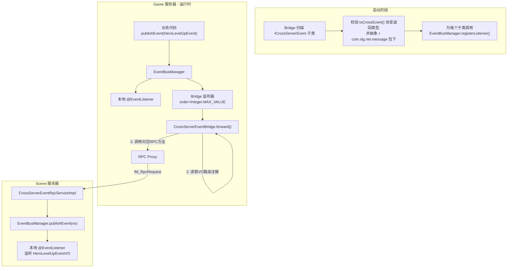
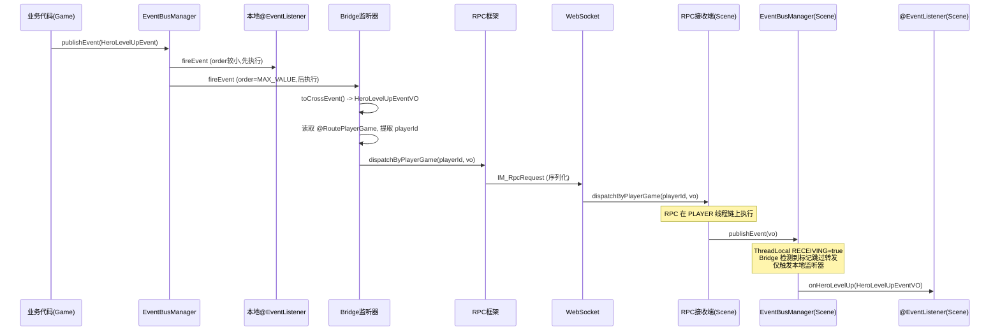
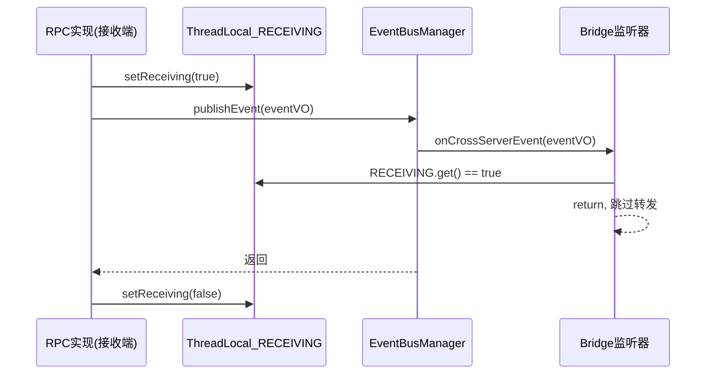

# 跨服事件传递方案

## 一、核心思路

**对 EventBusManager 零侵入**。`ICrossServerEvent` 接口定义在 `slg-net`，Bridge 启动时扫描所有具体子类，为每个子类调用 `EventBusManager.registerListener()` 注册转发监听器。扫描阶段同时对 `toCrossEvent()` 的**协变返回类型**进行强制校验：必须是 `com.slg.net.message` 包下的非抽象具体类。校验不通过则启动失败。

**防循环转发**：使用 **ThreadLocal 防重入标记**。RPC 接收端在发布事件前设置标记，Bridge 监听器检测到标记后跳过转发。由于事件分发是同步调用，`ThreadLocal` 在整个 `publishEvent -> fireEvent -> Bridge.onCrossServerEvent` 调用链中始终可见。

## 二、整体架构



## 三、分层设计

### 3.1 slg-net 层（全部跨服逻辑在此，slg-common 不做任何改动）

#### ICrossServerEvent 接口

位于 `com.slg.net.crossevent`，方法名 `toCrossEvent()`。接口本身在 net 模块定义，game/scene 依赖 net 可直接使用。

```java
public interface ICrossServerEvent extends IEvent {
    /**
     * 转换为可跨服传播的事件
     * <p>子类必须使用协变返回类型声明具体的返回类，例如：
     * <pre>
     * public HeroLevelUpEventVO toCrossEvent() { ... }
     * </pre>
     * <p>返回类型必须满足：
     * <ul>
     *   <li>非抽象、非接口的具体类</li>
     *   <li>位于 com.slg.net.message 包（或其子包）下</li>
     * </ul>
     * <p>返回 null 表示本次不需要跨服传播
     */
    IEvent toCrossEvent();
}
```

#### 启动时 toCrossEvent() 返回类型校验

Bridge 扫描到 `ICrossServerEvent` 子类后，通过反射获取该子类声明的 `toCrossEvent()` 方法的**协变返回类型**，执行以下校验（不通过则抛异常、启动失败）：

```java
// 对每个 ICrossServerEvent 子类
Method method = eventClass.getMethod("toCrossEvent");
Class<?> returnType = method.getReturnType();

// 校验 1：不允许返回 IEvent 原始类型（必须声明具体协变返回类型）
if (returnType == IEvent.class || returnType == Object.class) {
    throw new IllegalStateException(
        eventClass.getSimpleName() + " 的 toCrossEvent() 必须声明具体的协变返回类型，不能是 IEvent");
}

// 校验 2：返回类型必须位于 com.slg.net.message 包下
if (!returnType.getPackageName().startsWith("com.slg.net.message")) {
    throw new IllegalStateException(
        eventClass.getSimpleName() + " 的 toCrossEvent() 返回类型 " +
        returnType.getName() + " 必须位于 com.slg.net.message 包下");
}

// 校验 3：返回类型必须是非抽象具体类
if (returnType.isInterface() || Modifier.isAbstract(returnType.getModifiers())) {
    throw new IllegalStateException(
        eventClass.getSimpleName() + " 的 toCrossEvent() 返回类型 " +
        returnType.getSimpleName() + " 不能是接口或抽象类");
}
```

**关键机制**：Java 支持协变返回类型（covariant return type）。子类覆写方法时可以声明更具体的返回类型，`Method.getReturnType()` 会返回子类声明的具体类型而非接口定义的 `IEvent`。这要求子类**必须**写成：

```java
// 正确：声明了协变返回类型 HeroLevelUpEventVO
@Override
public HeroLevelUpEventVO toCrossEvent() { ... }

// 错误：返回类型仍然是 IEvent，校验会失败
@Override
public IEvent toCrossEvent() { ... }
```

#### 四种路由字段注解

放在 `com.slg.net.crossevent.anno` 包下，标注在事件 VO 的字段上，用于声明该事件的跨服路由策略。

- `@RouteServer` -- 标注 `int` 字段(serverId)，对应 `ServerIdRoute`，不作为 ThreadKey，接收端 TaskModule = SYSTEM
- `@RoutePlayerGame` -- 标注 `long` 字段(playerId)，对应 `PlayerGameRoute`，同时作为 ThreadKey，接收端 TaskModule = PLAYER
- `@RoutePlayerMainScene` -- 标注 `long` 字段(playerId)，对应 `PlayerMainSceneRoute`，同时作为 ThreadKey，接收端 TaskModule = PLAYER
- `@RoutePlayerCurrentScene` -- 标注 `long` 字段(playerId)，对应 `PlayerCurrentSceneRoute`，同时作为 ThreadKey，接收端 TaskModule = PLAYER

每个事件 VO 类有且仅有一个路由注解字段。Bridge 按 VO 类缓存路由元数据，避免每次反射。

#### RPC 接口

放在 `com.slg.net.crossevent.rpc`，定义 4 个分发方法，分别对应 4 种路由：

```java
public interface ICrossServerEventRpcService {

    @RpcMethod(routeClz = ServerIdRoute.class, useModule = TaskModule.SYSTEM)
    void dispatchByServer(@RpcRouteParams int serverId, Object eventVO);

    @RpcMethod(routeClz = PlayerGameRoute.class, useModule = TaskModule.PLAYER)
    void dispatchByPlayerGame(@RpcRouteParams @ThreadKey long playerId, Object eventVO);

    @RpcMethod(routeClz = PlayerMainSceneRoute.class, useModule = TaskModule.PLAYER)
    void dispatchByPlayerMainScene(@RpcRouteParams @ThreadKey long playerId, Object eventVO);

    @RpcMethod(routeClz = PlayerCurrentSceneRoute.class, useModule = TaskModule.PLAYER)
    void dispatchByPlayerCurrentScene(@RpcRouteParams @ThreadKey long playerId, Object eventVO);
}
```

关键点：

- 3 个玩家路由方法的 `playerId` 同时标注 `@RpcRouteParams` 和 `@ThreadKey`，实现"路由参数即分线 key"
- `Object eventVO` 利用现有 `MessageCodec` 的运行时多态序列化，只要 VO 类注册在 `message.yml` 即可正确编解码
- 全部为 `void` 返回值（fire-and-forget），跨服事件不需要等待结果

#### RPC 实现

接收端通过 `publishEvent()` 发布事件。发布前设置 `ThreadLocal` 防重入标记，Bridge 监听器检测到标记后跳过转发，防止循环。即使 VO 本身就是 `ICrossServerEvent`（如 `toCrossEvent()` 返回 `this`）也安全。

```java
@Component
public class CrossServerEventRpcServiceImpl implements ICrossServerEventRpcService {

    @Override
    public void dispatchByServer(int serverId, Object eventVO) {
        publishLocally(eventVO);
    }

    @Override
    public void dispatchByPlayerGame(long playerId, Object eventVO) {
        publishLocally(eventVO);
    }

    @Override
    public void dispatchByPlayerMainScene(long playerId, Object eventVO) {
        publishLocally(eventVO);
    }

    @Override
    public void dispatchByPlayerCurrentScene(long playerId, Object eventVO) {
        publishLocally(eventVO);
    }

    private void publishLocally(Object eventVO) {
        if (eventVO instanceof IEvent event) {
            // 设置防重入标记，Bridge 监听器检测到后跳过转发
            CrossServerEventBridge.setReceiving(true);
            try {
                EventBusManager.getInstance().publishEvent(event);
            } finally {
                CrossServerEventBridge.setReceiving(false);
            }
        }
    }
}
```

#### 跨服事件桥接器 `CrossServerEventBridge`

放在 `com.slg.net.crossevent.bridge`，核心机制：

**启动时** -- 扫描 -> 校验返回类型 -> 预构建 VO 路由元数据 -> 注册事件监听器。校验不通过则抛异常、启动失败。

**运行时** -- 事件 `publishEvent()` 触发 Bridge 监听器 -> 调用 `toCrossEvent()` -> 根据已缓存的 VO 路由元数据选择 RPC 方法 -> 转发。

```java
@Component
public class CrossServerEventBridge {

    /** ThreadLocal 防重入标记：接收远程事件时设为 true，阻止 Bridge 再次转发 */
    private static final ThreadLocal<Boolean> RECEIVING = ThreadLocal.withInitial(() -> false);

    @Autowired
    private EventBusManager eventBusManager;

    @RpcRef
    private ICrossServerEventRpcService rpcService;

    // VO类 -> 路由元数据（启动时一次性构建，运行时只读）
    private final Map<Class<?>, CrossServerEventMeta> metaCache = new ConcurrentHashMap<>();

    /** 供 RPC 实现类调用，设置/清除防重入标记 */
    public static void setReceiving(boolean value) {
        RECEIVING.set(value);
    }

    @PostConstruct
    public void init() throws Exception {
        // 1. 扫描所有 ICrossServerEvent 的具体实现类
        Set<Class<? extends ICrossServerEvent>> eventClasses = scanCrossServerEvents();

        // 2. 获取转发处理方法
        Method forwardMethod = this.getClass().getDeclaredMethod("onCrossServerEvent", IEvent.class);

        // 3. 对每个跨服事件类：校验返回类型 + 预构建元数据 + 注册监听器
        for (Class<? extends ICrossServerEvent> eventClass : eventClasses) {
            // --- 校验 toCrossEvent() 协变返回类型 ---
            Class<?> voType = validateAndGetVoType(eventClass);

            // --- 预构建 VO 路由元数据（也做路由注解校验） ---
            CrossServerEventMeta meta = CrossServerEventMeta.resolve(voType);
            metaCache.put(voType, meta);

            // --- 注册事件监听器 ---
            EventListenerWrapper wrapper = new EventListenerWrapper(
                this, forwardMethod, Integer.MAX_VALUE  // 最低优先级，本地监听器先执行
            );
            eventBusManager.registerListener(eventClass, wrapper);
            LoggerUtil.debug("[跨服事件] 注册转发监听: {} -> {}", 
                eventClass.getSimpleName(), voType.getSimpleName());
        }
    }

    /**
     * 校验子类 toCrossEvent() 的协变返回类型
     * 必须是：非抽象具体类 + 位于 com.slg.net.message 包下
     */
    private Class<?> validateAndGetVoType(Class<?> eventClass) throws NoSuchMethodException {
        Method method = eventClass.getMethod("toCrossEvent");
        Class<?> returnType = method.getReturnType();

        if (returnType == IEvent.class || returnType == Object.class) {
            throw new IllegalStateException(
                eventClass.getSimpleName() + " 的 toCrossEvent() 必须声明具体的协变返回类型");
        }
        if (!returnType.getPackageName().startsWith("com.slg.net.message")) {
            throw new IllegalStateException(
                eventClass.getSimpleName() + " 的 toCrossEvent() 返回类型 " +
                returnType.getName() + " 必须位于 com.slg.net.message 包下");
        }
        if (returnType.isInterface() || Modifier.isAbstract(returnType.getModifiers())) {
            throw new IllegalStateException(
                eventClass.getSimpleName() + " 的 toCrossEvent() 返回类型 " +
                returnType.getSimpleName() + " 不能是接口或抽象类");
        }
        return returnType;
    }

    /**
     * 跨服事件转发处理方法
     * 被 EventListenerWrapper 通过 MethodHandle 调用
     */
    public void onCrossServerEvent(IEvent event) {
        if (RECEIVING.get()) return; // 防重入

        if (!(event instanceof ICrossServerEvent csEvent)) return;

        IEvent vo = csEvent.toCrossEvent();
        if (vo == null) return; // 动态决定不转发

        // 启动时已预构建，直接取
        CrossServerEventMeta meta = metaCache.get(vo.getClass());

        switch (meta.getRouteType()) {
            case SERVER -> rpcService.dispatchByServer(meta.extractServerId(vo), vo);
            case PLAYER_GAME -> rpcService.dispatchByPlayerGame(meta.extractPlayerId(vo), vo);
            case PLAYER_MAIN_SCENE -> rpcService.dispatchByPlayerMainScene(meta.extractPlayerId(vo), vo);
            case PLAYER_CURRENT_SCENE -> rpcService.dispatchByPlayerCurrentScene(meta.extractPlayerId(vo), vo);
        }
    }

    /**
     * 扫描 com.slg 包下所有 ICrossServerEvent 的具体实现类
     */
    private Set<Class<? extends ICrossServerEvent>> scanCrossServerEvents() { ... }
}
```

**`CrossServerEventMeta`** 缓存每个 VO 类的路由信息：

```java
public class CrossServerEventMeta {
    private RouteType routeType;       // 路由类型枚举
    private MethodHandle fieldGetter;  // 路由字段的 MethodHandle（高效反射）

    /** 扫描 VO 类的字段注解，构建路由元数据（也校验路由注解是否存在且唯一） */
    public static CrossServerEventMeta resolve(Class<?> voClass) { ... }

    public int extractServerId(Object vo) { ... }
    public long extractPlayerId(Object vo) { ... }
}
```

#### 事件 VO 定义位置

- 路径：`slg-net/src/main/java/com/slg/net/message/innermessage/event/packet/`
- 命名：`XXXEventVO`（如 `HeroLevelUpEventVO`）
- 必须在 `message.yml` 中注册，协议号区间建议 **121-150**（innermessage 范围内）
- 必须实现 `IEvent`

示例：

```java
@Getter @Setter
public class HeroLevelUpEventVO implements IEvent {
    @RoutePlayerGame   // 声明路由策略：发往玩家所在的 Game 服
    private long playerId;
    private int heroId;
    private int level;
}
```

### 3.2 slg-game / slg-scene 层（业务接入）

需要跨服传播的事件实现 `ICrossServerEvent`，`toCrossEvent()` 必须使用**协变返回类型**声明具体 VO 类：

```java
@Getter @Setter
@AllArgsConstructor(staticName = "valueOf")
public class HeroLevelUpEvent implements IPlayerProgressEvent, ICrossServerEvent {
    private Player player;
    private int heroId;
    private int level;

    @Override
    public long getOwnerId() { return player.getId(); }

    @Override
    public HeroLevelUpEventVO toCrossEvent() {  // 协变返回类型，不能写 IEvent
        HeroLevelUpEventVO vo = new HeroLevelUpEventVO();
        vo.setPlayerId(player.getId());
        vo.setHeroId(heroId);
        vo.setLevel(level);
        return vo;
    }
}
```

接收端监听 VO 类型：

```java
@Component
public class SomeSceneListener {
    @EventListener
    public void onHeroLevelUp(HeroLevelUpEventVO event) {
        // 在场景服处理英雄升级事件
    }
}
```

## 四、数据流示意



## 五、防循环转发机制详解

使用 **ThreadLocal 防重入标记**，覆盖所有场景（包括 VO 就是事件自身、VO 也实现了 `ICrossServerEvent` 等边界情况）：



原理：

1. RPC 接收端在 `publishEvent()` 前设置 `RECEIVING = true`
2. `publishEvent()` 同步触发所有监听器（包括 Bridge）
3. Bridge 的 `onCrossServerEvent()` 检测到 `RECEIVING == true`，直接跳过
4. 事件发布完成后，`finally` 块清除标记
5. 整个过程在同一线程同步执行，`ThreadLocal` 在调用链全程可见

## 六、关键设计决策

- **ICrossServerEvent 位于 net 模块**：跨服事件本质依赖网络层，放在 `com.slg.net.crossevent`；game/scene 依赖 net 可直接使用
- **协变返回类型 + 启动校验**：子类 `toCrossEvent()` 必须声明具体 VO 类型（如 `HeroLevelUpEventVO`），启动时通过 `Method.getReturnType()` 反射获取并校验包路径、非抽象，不合格则启动失败
- **EventBusManager 零侵入**：不修改任何已有代码，Bridge 通过现有 `registerListener()` API 接入
- **ThreadLocal 防重入**：RPC 接收端设标记、Bridge 检标记，覆盖所有循环场景（VO 返回 this、VO 实现 ICrossServerEvent 等），无需对 VO 类型做额外约束
- **`EventListenerWrapper` 多态兼容**：Bridge 方法签名为 `onCrossServerEvent(IEvent)`，`MethodHandle` 天然支持接收任何 `IEvent` 子类
- **`order = Integer.MAX_VALUE`**：Bridge 监听器优先级最低，确保所有本地监听器先执行完毕后再转发
- **`toCrossEvent()` 返回 null 时跳过转发**：允许事件根据运行时条件动态决定是否需要跨服传播
- **路由元数据启动时预构建**：扫描阶段一次性解析所有 VO 的路由注解并缓存，运行时零反射
- **`Object eventVO` 参数**：利用现有 `MessageCodec` 基于运行时类型的多态序列化，VO 注册到 `message.yml` 即可正确编解码

## 七、新增文件清单

- `ICrossServerEvent.java` -- `com.slg.net.crossevent` -- 跨服事件接口
- `RouteServer.java` -- `com.slg.net.crossevent.anno` -- 路由注解：按 serverId
- `RoutePlayerGame.java` -- `com.slg.net.crossevent.anno` -- 路由注解：按玩家 Game 服
- `RoutePlayerMainScene.java` -- `com.slg.net.crossevent.anno` -- 路由注解：按玩家主场景服
- `RoutePlayerCurrentScene.java` -- `com.slg.net.crossevent.anno` -- 路由注解：按玩家当前场景服
- `RouteType.java` -- `com.slg.net.crossevent.model` -- 路由类型枚举
- `CrossServerEventMeta.java` -- `com.slg.net.crossevent.model` -- VO 路由元数据
- `CrossServerEventBridge.java` -- `com.slg.net.crossevent.bridge` -- 桥接器（扫描 + 校验 + 注册 + 转发）
- `ICrossServerEventRpcService.java` -- `com.slg.net.crossevent.rpc` -- RPC 接口
- `CrossServerEventRpcServiceImpl.java` -- `com.slg.net.crossevent.rpc` -- RPC 实现

**修改文件：无** -- 不修改 EventBusManager 或任何已有文件
